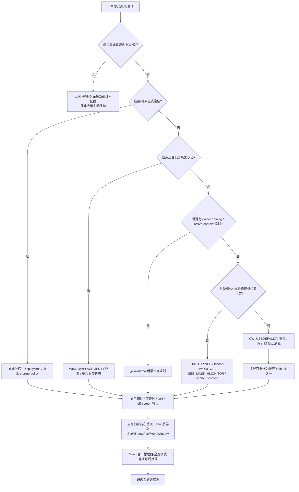

# Windows 多显示器窗口初始位置、恢复与特殊场景：最终合并研究报告

> **研究对象**：Windows 10/11 桌面窗口系统，重点为 Windows 11 与 Win32；同时覆盖 WPF、WinForms、Qt、Electron/Chromium、UWP/WinRT、WinUI 3 / Windows App SDK、屏幕保护程序、UAC/安全桌面、DXGI 全屏、RDP、虚拟桌面、Snap 与第三方窗口管理器。  


# 1. 总体结论


> **Windows 没有一条覆盖所有软件的“主屏优先”“鼠标屏优先”或“上次屏优先”总规则。窗口最终在哪块显示器，取决于应用自身定位/恢复、窗口关系、启动上下文、框架、Windows 默认放置以及当前显示拓扑/DPI 等多层因素。**


# 2. 最终心智模型：Windows 到底如何决定窗口在哪块屏？

不要把它理解为：

```text
主屏优先
```

也不要理解为：

```text
鼠标在哪屏 → 新窗口就在哪屏
```

更准确的思路是：



**关键修正：**

这个图是工程诊断模型，不是 Microsoft 对外承诺的一条总优先级算法。

---

# 3. 基础模型：进程没有“所属显示器”

## 3.1 屏幕归属是窗口级，而不是进程级

可以把 Win32 的关系理解为：

```text
Process
  └─ Thread
      └─ HWND
          └─ RECT
              └─ 与某 HMONITOR 的关系
```

`HMONITOR` 是通过窗口、矩形或点计算出来的显示器对象句柄，不是进程创建时就被分配的永久“所属屏幕”。

同一进程可以同时有：

```text
Browser.exe
  ├─ 主窗口：显示器 2
  ├─ 下载窗口：显示器 1
  └─ 工具窗口：显示器 3
```

也可以：

- 没有可见 HWND；
- 多个 HWND 分布在不同显示器；
- 第二次“启动”时根本不新建可见窗口，只把请求发给已有进程。

所以：

> “这个 EXE 属于主屏还是副屏？”本身不是一个正确的 Win32 窗口模型问题。

---

## 3.2 DWM 不是普通应用启动 monitor 的统一决策者

DWM 主要承担：

- 桌面合成；
- 窗口视觉效果与动画；
- 缩略图；
- 合成多显示器输出；
- 窗口视觉边界等。

普通应用主窗口首次应该在哪块显示器，通常是：

- 应用自身；
- User32 默认放置；
- Shell 启动上下文；
- UI 框架；
- 特殊窗口系统组件；

共同作用的结果。

---

# 4. 虚拟屏幕坐标：主屏只是兼容锚点

## 4.1 Virtual Screen

多个显示器拼成一个虚拟屏幕坐标空间。

典型布局：

```text
显示器 B（左）
x = -1920..-1

显示器 A（主屏）
x = 0..1919
```

或：

```text
显示器 C（上）
y < 0

主屏
(0,0) 起
```

因此副屏坐标可以是负数。

需要强调：

- `SM_CXSCREEN / SM_CYSCREEN` 是**主显示器**指标；
- `SM_XVIRTUALSCREEN / SM_YVIRTUALSCREEN` 是整个虚拟屏幕左上角；
- `SM_CXVIRTUALSCREEN / SM_CYVIRTUALSCREEN` 是整个虚拟屏幕尺寸。

把所有坐标都假设为：

```text
x >= 0
y >= 0
```

是常见多屏 bug。

---

## 4.2 “Windows 虚拟屏幕”与 Windows 10/11 的“虚拟桌面”不是同一个概念

两个术语容易混淆：

### Virtual Screen / multi-monitor desktop coordinates

表示多个物理/虚拟显示器组成的一个坐标平面。

### Windows Virtual Desktops（“桌面 1 / 桌面 2”）

表示不同工作区中的窗口集合。

`IVirtualDesktopManager` 文档强调：

- 每个窗口属于一个虚拟桌面；
- 新窗口应出现在当前活动虚拟桌面；
- 应用复用旧窗口时，应该优先只复用当前虚拟桌面里的窗口，否则创建新窗口。

所以“显示器 2”与“虚拟桌面 2”完全不是同一维度。

---

# 5. `rcMonitor` 与 `rcWork`

`GetMonitorInfo` 提供两个重要矩形：

| 字段 | 含义 |
|---|---|
| `rcMonitor` | 完整显示器区域 |
| `rcWork` | 工作区，通常排除任务栏/AppBar 等保留区域 |

普通顶层窗口：

- 居中、恢复、最大化时通常应考虑 `rcWork`。

真正全屏：

- 游戏、幻灯片、无边框全屏等通常需要 `rcMonitor`。

Microsoft 的多显示器文档还明确区分：

> 最大化窗口不会覆盖 always-on-top 任务栏，而真正的 full-screen window 会覆盖任务栏。

---

# 6. Windows 怎样判断窗口“主要属于哪块屏”

常用 API：

```cpp
MonitorFromWindow(hwnd, flags)
MonitorFromRect(&rect, flags)
MonitorFromPoint(pt, flags)
```

`MonitorFromWindow` 的公开行为：

- 窗口与一个或多个显示器相交时，返回**交集面积最大**的 monitor；
- 如果窗口当前最小化，使用它最小化前的矩形进行判断。

因此窗口横跨两块屏时，很多 Windows API 的“当前 monitor”并不是简单看左上角，而是主要按相交面积。

常用 fallback：

```cpp
MONITOR_DEFAULTTONULL
MONITOR_DEFAULTTOPRIMARY
MONITOR_DEFAULTTONEAREST
```

---

# 7. 普通 Win32 新窗口：显式坐标时应用说了算

顶层窗口：

```cpp
CreateWindowEx(
    ...,
    x, y, width, height,
    ...
);
```

使用虚拟桌面屏幕坐标。

例如：

```text
主屏：0..1919
右侧副屏：1920..3839
```

应用给：

```text
x = 2200
y = 100
```

窗口就可以直接出现在右侧副屏。

Windows 不存在一个公开规则：

```text
if monitor != primary:
    force_window_to_primary();
```

因此：

> 主显示器身份不会覆盖应用给出的合法副屏坐标。

---

# 8. `CW_USEDEFAULT`：什么时候才真正讨论 Windows 默认放置

当应用把窗口初始位置交给：

```cpp
CW_USEDEFAULT
```

它才真正进入 Windows 默认放置路径。

公开契约只告诉应用“由系统选择默认位置”，并没有提供一条跨 Windows 版本永远不变的“monitor 选择总算法”。

Raymond Chen 曾解释过某个历史 Windows 实现，大致是：

```text
有 owner
    → owner monitor
否则 ShellExecuteEx 有 SEE_MASK_HMONITOR
    → 指定 monitor
否则
    → primary monitor
然后在该 monitor 内做 default cascade
```

但原文明确提醒这是：

> implementation detail

因此：

- 可以用来理解历史行为；
- 不可以作为产品未来兼容性合同；
- 不应写成“Windows 永远按 owner → shell monitor → primary”。

**最终结论：**

> “无任何更强上下文、并且确实走 `CW_USEDEFAULT` 时常见落主屏”是合理观察；“`CW_USEDEFAULT` 永远主屏”是错误结论。

---

# 9. `STARTUPINFO`：启动者能影响第一扇窗口

## 9.1 `STARTF_USEPOSITION`

相关字段：

```cpp
dwX
dwY
dwXSize
dwYSize
wShowWindow
dwFlags
```

如果：

```cpp
dwFlags & STARTF_USEPOSITION
```

则 `dwX/dwY` 有公开语义。

对于第一扇 GUI overlapped window：

- 应用走 `CW_USEDEFAULT`；
- 系统可使用进程启动时指定的 `dwX/dwY`。

这解释了为什么启动器有时能影响新进程的第一扇窗口，但也解释了为什么它不是“强制 monitor”：

- 应用可以不用 `CW_USEDEFAULT`；
- 应用之后可以再次移动；
- 真实可见窗口可以由另一个已有进程创建。

---

## 9.2 `STARTUPINFO.wShowWindow`

如果设置：

```cpp
STARTF_USESHOWWINDOW
```

则 `wShowWindow` 影响 GUI 进程第一次 `ShowWindow` 的初始显示状态。

这与：

- 正常；
- 最大化；
- 最小化；

有关，不等于“指定显示器”。

标准 `.lnk` 的“运行：正常窗口 / 最大化 / 最小化”也主要属于 show state，而不是持久目标 monitor ID。

---

# 10. 任务栏 / Jump List：Windows 8+ 的 monitor hint

这是三份报告里报告 B 最重要的独有细节之一。

Microsoft `STARTUPINFO` 文档明确说明：

> 如果进程从任务栏或 Jump List 启动，系统会把 `hStdOutput` 设置为包含该任务栏或 Jump List 的 monitor handle。该行为从 Windows 8 / Windows Server 2012 开始。

应用应：

```cpp
STARTUPINFO si{};
si.cb = sizeof(si);
GetStartupInfo(&si);

HMONITOR hm = reinterpret_cast<HMONITOR>(si.hStdOutput);

MONITORINFO mi{ sizeof(mi) };
if (hm && GetMonitorInfo(hm, &mi)) {
    // 使用 mi.rcWork / mi.rcMonitor 定位自己的窗口
}
```

注意：

> 这不是系统对任意应用的强制搬窗。

如果应用不读取/不采用 monitor hint，它仍可能：

- 恢复上次显示器；
- 去主屏；
- 跟 owner；
- 使用 WPF/Qt/Electron 自己的策略；
- 激活已有实例。

因此现实中：

```text
App A：点哪块屏的任务栏 → 新窗口就到哪块屏
App B：永远回最后关闭位置
App C：总去主屏
```

三种都可能是合法设计。

---

# 11. `ShellExecuteEx + SEE_MASK_HMONITOR`

`SHELLEXECUTEINFO` 的公开字段允许：

```cpp
sei.fMask |= SEE_MASK_HMONITOR;
sei.hMonitor = hMonitor;
```

这是一条明确的 Shell 多显示器机制。

此外，多显示器定位文档还建议：

> 调用 `ShellExecute` / `ShellExecuteEx` 时提供一个 `hWnd`，这样系统会让新窗口与调用应用位于同一个 monitor。

但仍要区分：

### 启动上下文

Shell 能提供：

- `hMonitor`;
- owner `hWnd`;
- shortcut context;
- `STARTUPINFO`;

### 最终几何位置

目标程序可以在启动后再次：

```cpp
SetWindowPos
MoveWindow
SetWindowPlacement
```

所以 Shell 的 monitor 选择不是不可覆盖的“沙箱限制”。

---

# 12. 快捷方式在哪块屏？

## 12.1 官方规则

Microsoft 多显示器文档：

> 系统尝试在包含其快捷方式的 monitor 上启动应用。

所以把桌面快捷方式放到目标 monitor，确实可以影响默认启动上下文。

---

## 12.2 为什么仍然不能说“快捷方式决定屏幕”

标准 `.lnk` 通常保存：

- 目标；
- 参数；
- working directory；
- icon；
- show command；
- 其他 Shell Link 元数据。

它并不是一个稳定的：

```text
TargetMonitorId = PhysicalMonitorSerial123
```

持久化窗口位置格式。

而且目标程序可能：

- 是单实例；
- 恢复自己的旧位置；
- 创建多个窗口；
- 在启动后主动搬窗。

因此准确结论：

> **快捷方式所在 monitor 可以影响 Shell 的默认启动位置，但它不是目标应用必须服从的显示器绑定。**

---

# 13. 从开始菜单、资源管理器、命令行启动的差异

## 13.1 开始菜单

开始菜单出现在哪块屏与应用最终主窗口在哪块屏是两个问题。

现代 Shell 可以提供启动上下文，但应用仍可：

- 复用已有实例；
- 恢复历史位置；
- 用框架策略重定位。

所以：

```text
开始菜单在副屏
≠
目标应用必定副屏
```

---

## 13.2 文件资源管理器双击文件

例如副屏 Explorer 双击 `.docx`：

### Office 已运行

文件可能通过已有实例打开，旧窗口所在屏更重要。

### Office 未运行

新进程启动后仍可能恢复 Office 自己的窗口历史。

### 文件关联处理器使用 DDE/COM/协议激活

真实文档窗口可能由另一个进程/已有进程创建。

因此 Explorer 所在 monitor 只能成为上下文之一。

---

## 13.3 `cmd` / PowerShell / Windows Terminal / Win+R

`CreateProcess` 没有通用 `HMONITOR targetMonitor` 参数。

所以：

> “终端窗口在副屏”并不会让新 GUI 子进程自动继承副屏。

可靠控制方式通常是：

1. 应用自己接受 `--monitor` / `--x --y` 参数；
2. 使用 `ShellExecuteEx + SEE_MASK_HMONITOR`（适用 Shell 场景）；
3. 启动后等待 HWND 再 `SetWindowPos`；
4. 通过 IPC 让应用自身移动。

---

# 14. 已有实例：很多“新启动”其实根本没发生新窗口默认放置

典型单实例流程：

```text
第一次 app.exe
    ↓
主进程 + HWND 已存在

第二次点击 app.exe / 文件
    ↓
新进程短暂启动，或激活协议触发
    ↓
检测已有实例
    ↓
Named Pipe / Mutex / COM / DDE / WM_COPYDATA / AppInstance
    ↓
旧进程收到请求
    ↓
SetForegroundWindow(旧 HWND)
或者在旧进程创建新文档窗口
```

常见单实例机制：

- `CreateMutex`;
- `FindWindow`;
- 命名管道；
- socket；
- DDE；
- COM；
- AppUserModelID/激活协议；
- Windows App SDK `AppInstance`;
- 文件映射 / 自定义 IPC。

这里关键问题不是：

```text
第二次启动来自哪块屏？
```

而是：

```text
真正的可见 HWND 是谁创建的？
```

---

# 15. 前台激活不等于移动窗口

`SetForegroundWindow` 主要影响：

- 前台激活；
- 输入焦点/用户注意力；
- Z-order/任务栏提示等相关状态。

它并不等价于：

```cpp
SetWindowPos(...)
```

所以已有窗口在副屏时：

```cpp
SetForegroundWindow(hwnd)
```

不会天然把它移动到主屏。

另外 Windows 对后台进程抢前台有约束，因此“激活失败只闪任务栏”和“窗口位置错了”也要区分。

---

# 16. Owner、Parent、Dialog：这是最稳定的一组多屏规则

## 16.1 Owner 与 Parent 不是一个概念

- child window 的 `parent` 决定其客户区/层级关系；
- top-level owned window 的 `owner` 决定生命周期、Z-order 与很多 UI 上下文。

工程中不要把“父窗口”和“owner”混用。

---

## 16.2 Owned Window

Microsoft 多显示器文档的公开规则：

> owned window 与 owner 位于同一个 monitor。

这对：

- 工具窗口；
- 浮动面板；
- 模态窗口；
- 辅助窗口；

非常关键。

---

## 16.3 Dialog Box

公开多屏规则可概括为：

1. 有 owner → owner 所在 monitor；
2. `DS_CENTERMOUSE` → 鼠标所在 monitor；
3. 无 owner，但活动窗口属于同一应用 → 活动窗口 monitor；
4. 无 owner，活动窗口属于其他应用 → primary monitor。

这解释了很多：

> “设置对话框为什么跑主屏？”

根因往往是：

> 应用创建了 ownerless dialog。

---

## 16.4 MessageBox

有 owner：

```cpp
MessageBox(hwndOwner, ...);
```

通常跟 owner monitor。

没有 owner：

```cpp
MessageBox(nullptr, ...);
```

就失去最可靠的 monitor 上下文，容易落入活动窗口/主屏等默认路径。

---

## 16.5 菜单、下拉列表

Microsoft 文档还定义了多种 UI 对象的 monitor 规则，例如：

| UI | 常见/公开 monitor 依据 |
|---|---|
| 右键菜单 | 右键发生的 monitor |
| submenu | 对应 menu item 主要所在 monitor |
| ComboBox 下拉列表 | ComboBox 矩形对应 monitor |
| `DS_CENTERMOUSE` dialog | 鼠标 monitor |
| owned window | owner monitor |
| MessageBox | owner monitor |

这再次说明 Windows 不存在“所有新 UI 一律主屏”的总规则。

---

# 17. 历史位置记忆：最常被误解的地方

“Windows 记住窗口位置”至少要分成三层。

---

## 17.1 第一层：应用自己保存位置 —— 最常见

典型流程：

```text
关闭窗口
    ↓
GetWindowPlacement / GetWindowRect / 框架 API
    ↓
Registry / JSON / INI / SQLite / QSettings / app data
    ↓
下次启动
    ↓
SetWindowPlacement / SetWindowPos / framework restore
```

可能保存：

- `x/y`;
- width/height；
- normal/maximized/fullscreen；
- `WINDOWPLACEMENT`;
- monitor device identity；
- DPI；
- 相对工作区位置；
- 多窗口布局；
- Dock 面板；
- 最近活动窗口；
- Snap/布局相关状态（若应用自身记录）。

因此：

> 一个程序“总回副屏”，最常见原因之一就是应用自己记住了它。

Windows 11 的 monitor-connection 开关关闭，也不能禁止应用写自己的配置。

---

## 17.2 正常关闭、崩溃与强制结束

应用何时保存状态是应用策略。

### 正常关闭

常见：

- `WM_CLOSE`;
- `WM_DESTROY`;
- application exit hook；
- 框架 shutdown event；

写入最新几何位置。

### 崩溃 / Task Manager 强制结束

可能：

- 没机会写最新状态；
- 留下上一次正常退出的配置；
- 写出一半；
- 自动恢复 session；
- 使用独立的周期性持久化。

所以“我刚把窗口拖到主屏，但杀进程后下一次又回副屏”不一定是 Windows 强制恢复，可能只是应用根本没保存刚才的新位置。

---

# 18. `GetWindowPlacement / SetWindowPlacement`

## 18.1 为什么比只存 `GetWindowRect` 更适合主窗口状态

`WINDOWPLACEMENT` 包含：

- `showCmd`;
- `rcNormalPosition`;
- 最小化/最大化相关数据。

例如窗口当前最大化时：

```text
当前可见边界
≠
恢复到 normal 时应使用的矩形
```

`rcNormalPosition` 才能保留正常状态下的恢复位置。

工程上通常不应把“当前最大化矩形”直接存成下次 normal 窗口大小。

---

## 18.2 完全 off-screen 的公开保护

`SetWindowPlacement` 明确保证：

> 如果指定 placement 会让窗口**完全位于屏幕之外**，系统会自动调整坐标使窗口可见，并考虑分辨率和多显示器配置变化。

关键限定：

```text
完全 off-screen
```

不是：

```text
只要部分越界就保证完全钳制到 rcWork
```

因此成熟应用仍建议主动验证恢复矩形。

---

## 18.3 Workspace coordinates 与 screen coordinates

对没有 `WS_EX_TOOLWINDOW` 的顶层窗口，`WINDOWPLACEMENT` 的若干字段使用 workspace coordinates。

而：

```cpp
SetWindowPos
```

使用 screen coordinates。

错误模式：

```text
GetWindowPlacement
    ↓
取 rcNormalPosition
    ↓
直接 SetWindowPos
```

在任务栏位于左/上边、AppBar 改变工作区等环境中可能造成“window creep”——每次启动逐步偏移。

原则：

> **`GetWindowPlacement` 与 `SetWindowPlacement` 成对使用。**

如果应用自己存屏幕坐标，则整个链路坚持同一种坐标语义。

---

# 19. Windows 11 “Remember window locations based on monitor connection”

Windows 设置：

```text
Settings
→ System
→ Display
→ Multiple displays
```

当前有：

- `Remember window locations based on monitor connection`
- `Minimize windows when a monitor is disconnected`

Microsoft Support 仍明确列出这些选项。

Windows 11 最初的 Docking 官方说明也描述了：

```text
外接显示器断开
    ↓
外接屏上的窗口被最小化/处理
    ↓
重新连接
    ↓
窗口回到之前位置
```

正确心智模型：

> 这是**显示器连接拓扑恢复体验**，尤其服务于 dock / undock / reconnect。

它不是：

```text
Windows 为每个 EXE 永久保存“最后启动 monitor”
```

也不等于：

```text
关闭该开关后应用就不能自己记位置
```

---

## 19.1 Windows 11 系统记忆与应用记忆冲突

可能出现：

### 应用一直没退出，外接屏断开后重连

Windows 11 系统 docking memory 很可能最明显。

### 应用关闭后重新启动

应用自己的持久化位置往往影响更大。

### 应用恢复了已不存在显示器的坐标

还会叠加：

- `SetWindowPlacement` off-screen 修正；
- 应用自己的 nearest-monitor clamp；
- 主屏 fallback；
- DPI 重新计算。

所以不要期待一个单一优先级。

---

# 20. 旧 WinRT `Windows.UI.WindowManagement.AppWindow` 的系统持久化

Windows 10 1903 引入过 `Windows.UI.WindowManagement.AppWindow` 路线。

其中：

```text
PersistedStateId
ClearPersistedState
ClearAllPersistedState
```

官方文档说明 `PersistedStateId` 用于：

> 让 Shell 在窗口移动/大小变化时跟踪并保存状态，以便之后或其他 session 重建相同窗口体验。

这说明 Windows 平台确实存在过“平台托管窗口持久化”模型。

但它与传统 Win32：

```text
应用自己写 Registry/JSON
```

不是一回事。

---

# 21. Windows App SDK / WinUI 3

## 21.1 稳定的现代窗口定位能力

WinUI 3 / Windows App SDK 可通过：

```text
WindowId
AppWindow
DisplayArea
```

管理窗口。

典型流程：

```csharp
var hwnd = WinRT.Interop.WindowNative.GetWindowHandle(window);
var windowId = Win32Interop.GetWindowIdFromWindow(hwnd);
var appWindow = AppWindow.GetFromWindowId(windowId);

var area = DisplayArea.GetFromWindowId(
    windowId,
    DisplayAreaFallback.Nearest
);

appWindow.MoveAndResize(
    new RectInt32(x, y, width, height),
    area
);
```

`DisplayArea` 提供：

- `IsPrimary`;
- `OuterBounds`;
- `WorkArea`;
- `DisplayId`;
- `GetFromWindowId`;
- `GetFromPoint`;
- `GetFromRect`;
- `FindAll`.

`AppWindow.MoveAndResize(RectInt32, DisplayArea)` 可以相对指定 display area 放置窗口。

---

## 21.2 新 placement persistence API：截至 2026-08-28 仍应视为 Experimental

Microsoft 文档中的以下成员：

```text
AppWindow.PersistedStateId
AppWindow.PlacementRestorationBehavior
AppWindow.GetCurrentPlacement
AppWindow.SaveCurrentPlacement
AppWindow.SetCurrentPlacement
AppWindowPlacementDetails
```

当前相应 API 页面仍带：

```text
Windows.Foundation.Metadata.Experimental
```

且从稳定 `1.8` 视图访问相关具体成员时可回退到 experimental 文档。

因此：

> **不能把这些新 placement persistence API 当作所有稳定 Windows App SDK 版本都可依赖的生产合同。**

这与稳定的：

```text
AppWindow.Move
AppWindow.MoveAndResize
DisplayArea
```

要区分。

---

# 22. Explorer Bags / BagMRU：不要当成第三方窗口位置数据库

Explorer/Shell 有历史上的：

```text
HKCU\Software\Classes\Local Settings\Software\Microsoft\Windows\Shell\Bags
HKCU\Software\Classes\Local Settings\Software\Microsoft\Windows\Shell\BagMRU
```

它们主要服务 Explorer/Shell 的文件夹视图与相关 Shell 状态。

需要保留报告 A 的正确结论：

> **这不是 Windows 为所有第三方应用统一保存窗口 monitor/geometry 的通用数据库。**

不建议通过修改 Bags 来“修复所有软件总在副屏打开”。

---

# 23. 显示器身份：为什么“同一块物理屏”有时不被当成同一连接

Windows 的硬件显示文档说明，EDID / DisplayID 中：

> 每台设备唯一序列号用于跟踪针对单个显示器的用户偏好。

所以稳定显示器身份很重要。

但不要进一步猜测：

```text
Windows 11 Remember window locations
一定只用 EDID serial 当数据库 key
```

Microsoft 没公开该功能完整 monitor matching 算法。

真实环境可能变化：

- DP ↔ HDMI；
- USB-C Dock 换端口；
- MST hub；
- KVM；
- 驱动重装；
- GPU 输出重枚举；
- EDID 读取失败/变化；
- 无线投屏；
- RDP 虚拟输出；
- 显示器固件变化。

因此：

> Windows 看到的“连接拓扑/目标设备”可能变了，即使用户认为“还是桌上那块显示器”。

---

# 24. `HMONITOR`、`DISPLAY1` 等不要当永久物理 ID

`HMONITOR` 是运行时句柄。

`\\.\DISPLAY1` / `DISPLAY2`、枚举顺序、adapter/source/target 路径也可能因：

- 重新插拔；
- 驱动；
- Dock；
- 主屏切换；
- GPU 变化；

而改变。

应用如果需要跨 session 尽可能识别同一显示器，应结合：

- `QueryDisplayConfig`;
- `DisplayConfigGetDeviceInfo`;
- target friendly name；
- device path / adapter + target 信息；
- 可获得的稳定设备标识；
- EDID 信息；
- fallback 到最近/主显示器。

不要把单个 `HMONITOR` 值写入配置后跨重启复用。

---

# 25. 主显示器切换为什么会让旧坐标“漂移”

主显示器长期承担 `(0,0)` 的兼容锚点。

原布局：

```text
B（副屏）        A（主屏）
[-1920,-1]      [0,1919]
```

把 B 改为主屏后，虚拟坐标的组织会随显示布局调整。

只保存：

```text
x, y, width, height
```

而不保存 monitor 上下文的应用，可能出现：

- 同一数字坐标映射到不同物理位置；
- 窗口落到另一块屏；
- 窗口部分/完全屏外；
- 最大化恢复到错误 monitor。

成熟恢复策略应至少保存：

```text
normal placement
monitor identity hint
old monitor work area
relative position
DPI/context
```

---

# 26. `QueryDisplayConfig` 与 `DisplayConfigGetDeviceInfo`

这些 API 用于查询当前显示路径/拓扑：

```cpp
QueryDisplayConfig(...)
DisplayConfigGetDeviceInfo(...)
```

可以获取：

- source/target path；
- adapter/target 信息；
- monitor friendly name；
- preferred mode；
- source device name；
- 当前拓扑。

它们是**显示拓扑 API**，不是“给某应用指定启动 monitor”的窗口 API。

因此不要把：

```text
我能枚举 DISPLAYCONFIG path
```

误解为：

```text
Windows 会自动按这个路径替应用恢复窗口
```

---

# 27. DPI：目标屏选对了，位置仍可能看起来“变了”

多显示器常见：

```text
主屏：4K / 150%
副屏：1080p / 100%
```

Per-Monitor DPI-aware 窗口跨屏时收到：

```cpp
WM_DPICHANGED
```

`lParam` 给出：

> 针对新 DPI 缩放后的建议窗口位置和尺寸。

应用预期用：

```cpp
SetWindowPos(...)
```

应用若混用：

- DIP / 逻辑坐标；
- 物理像素；
- DPI virtualization；
- `GetWindowRect`;
- DWM 扩展边界；
- 不同 DPI awareness context；

就会出现：

- 恢复后偏移；
- 尺寸变大/变小；
- 左上角微调；
- 看似“Windows 忘了原屏”。

实际上可能是 DPI 适配错误。

相关 API：

```text
GetDpiForWindow
WM_DPICHANGED
SetThreadDpiAwarenessContext
AdjustWindowRectExForDpi
GetWindowRect
DwmGetWindowAttribute(DWMWA_EXTENDED_FRAME_BOUNDS)
```

---

# 28. 睡眠、拔插、Dock/KVM：为什么窗口会突然乱屏

副屏“暂时消失”不只发生在拔线。

睡眠/唤醒时可能出现：

```text
外接显示路径先断开
    ↓
Windows 暂时认为只剩内屏
    ↓
窗口被重新安排/最小化
    ↓
几百毫秒/数秒后外接显示器回来
```

还可能有：

- Dock 固件；
- MST；
- KVM；
- USB-C alt mode；
- 显卡驱动重启；
- 显示器休眠行为。

Windows 11 monitor-connection memory 正是为了改善这类 docking/undocking 体验之一。

应用仍应监听：

```text
WM_DISPLAYCHANGE
WM_DEVICECHANGE
WM_SETTINGCHANGE
WM_DPICHANGED
```

并避免在拓扑尚未稳定时做不可逆的持久化。

---

# 29. WPF：`WindowStartupLocation` 是明确框架策略

常见：

```csharp
WindowStartupLocation.Manual
WindowStartupLocation.CenterScreen
WindowStartupLocation.CenterOwner
```

## `Manual`

- 按 `Left` / `Top`；
- 若未指定，交给 Windows。

## `CenterScreen`

**[框架契约]**：

> 居中到包含鼠标光标的屏幕。

所以：

```text
鼠标在副屏
+ WPF CenterScreen
→ 副屏
```

是框架设计，不是 Windows 随机。

## `CenterOwner`

> 居中到 owner。

没有 owner 时，按 `Manual` 类似逻辑处理。

---

# 30. WinForms：不要把“current display”擅自改写成“鼠标屏”

`FormStartPosition` 包括：

```text
Manual
CenterScreen
WindowsDefaultLocation
WindowsDefaultBounds
CenterParent
```

默认值通常是：

```text
WindowsDefaultLocation
```

官方对 `CenterScreen` 的措辞是：

> The form is centered on the current display.

这不像 WPF 文档那样明确写“screen that contains the mouse cursor”。

因此最终报告不把 WinForms `CenterScreen` 硬解释为：

```text
一定鼠标所在屏
```

若开发者需要精确显示器策略，应直接使用：

```csharp
Screen.AllScreens
Screen.FromHandle(...)
Screen.FromPoint(...)
```

并显式计算目标工作区。

---

# 31. Qt

Qt 官方提供：

```text
QScreen
QGuiApplication::screens()
QWindow::screen()
QWindow::setScreen()
```

Qt Widgets 还提供：

```cpp
saveGeometry()
restoreGeometry()
saveState()
restoreState()
```

Qt 官方“Restoring a Window's Geometry”文档说明：

- Windows 上可保存/恢复窗口 geometry；
- `QWidget::restoreGeometry()` 会检查恢复几何是否超出可用屏幕区域，并进行适当修正；
- 常与 `QSettings` 一起持久化。

因此很多 Qt 应用“记住上次屏幕”可以完全由 Qt/应用层完成，不需要 Windows 11 全局替它保存。

---

# 32. Electron / Chromium 桌面应用

Electron 的 `screen` 模块提供：

```javascript
screen.getPrimaryDisplay()
screen.getAllDisplays()
screen.getDisplayNearestPoint(point)
screen.getDisplayMatching(rect)
```

`BrowserWindow` 支持：

```javascript
win.setBounds(...)
win.getBounds()
win.getNormalBounds()
win.setPosition(...)
```

所以 Electron 应用非常容易自己实现：

```text
退出时保存 x/y/w/h
    ↓
下次读取
    ↓
screen.getDisplayMatching(savedBounds)
    ↓
校验
    ↓
BrowserWindow.setBounds()
```

很多 Electron 应用的“历史显示器”不是 Windows 系统替它记住，而是应用自己保存在 JSON/用户数据目录。

Electron 还使用 DIP 等抽象，混合 DPI 时也必须注意坐标转换。

---

# 33. `IApplicationActivationManager`：激活不等于指定 monitor

`IApplicationActivationManager` 提供：

```text
ActivateApplication
ActivateForFile
ActivateForProtocol
```

用于 Windows Store / 打包应用等激活场景。

公开接口本身不是：

```text
ActivateApplicationOnHMONITOR(...)
```

因此：

> 激活机制解决“启动/协议/文件激活”，不天然等于“把主窗口放到指定 monitor”。

现代应用的真实窗口位置仍可能由：

- Shell；
- AppModel；
- AppWindow；
- 应用状态；
- 已有实例；

共同决定。

---

# 34. `IShellLink`：show state 不等于 monitor

`IShellLink::SetShowCmd` 可设置：

- normal；
- maximized；
- minimized；

等初始 show command。

这不是一个通用持久化：

```text
Monitor #2
```

字段。

所以：

```text
快捷方式设置“最大化”
```

表示窗口进入最大化状态；**先在哪块显示器**仍取决于窗口 placement / Shell context / 应用逻辑。

---

# 35. `SPI_GETWORKAREA`：只拿主显示器工作区

这是一个常见老程序多屏 bug 来源。

Windows 多显示器 system metrics 文档明确：

> `SPI_GETWORKAREA` 始终返回主显示器工作区。

其他 monitor 应使用：

```cpp
GetMonitorInfo(hMonitor, &mi)
```

读取：

```text
mi.rcWork
```

因此以下代码：

```cpp
SystemParametersInfo(SPI_GETWORKAREA, ...)
```

不能被当作“当前窗口所在屏的工作区”。

---

# 36. 工作区与 AppBar

除任务栏外，应用还可能通过 AppBar 占用工作区。

相关：

```text
SHAppBarMessage
GetMonitorInfo(rcWork)
```

开发多屏 appbar 或恢复普通窗口时，不应只用：

```text
SM_CXSCREEN
SM_CYSCREEN
```

否则会把几何计算锁死在主屏。

---

# 37. 常见窗口/显示变化消息

应用可根据需要处理：

```text
WM_DISPLAYCHANGE
WM_DEVICECHANGE
WM_SETTINGCHANGE
WM_DPICHANGED
WM_WINDOWPOSCHANGING
WM_WINDOWPOSCHANGED
WM_MOVE
WM_SIZE
WM_GETMINMAXINFO
```

意义大致为：

| 消息 | 作用 |
|---|---|
| `WM_DISPLAYCHANGE` | 显示配置/分辨率变化 |
| `WM_DEVICECHANGE` | 设备变化 |
| `WM_SETTINGCHANGE` | 系统参数变化 |
| `WM_DPICHANGED` | 窗口有效 DPI 变化 |
| `WM_WINDOWPOSCHANGING/CHANGED` | 窗口几何/Z-order 变化 |
| `WM_MOVE` | 位置变化 |
| `WM_SIZE` | 大小/最大化/最小化变化 |
| `WM_GETMINMAXINFO` | 最小/最大跟踪尺寸与最大化约束 |

---

# 38. 最大化 vs 全屏

最大化和全屏是不同语义。

## 最大化普通窗口

通常约束在目标 monitor 的工作区：

```text
rcWork
```

## 全屏

通常覆盖：

```text
rcMonitor
```

因此不要用“窗口最大化”替代“真正全屏”来推断 monitor 选择。

---

# 39. DXGI 独占/全屏：可以显式选输出

`IDXGISwapChain::SetFullscreenState`：

```cpp
SetFullscreenState(TRUE, pTarget);
```

`pTarget` 可以是指定的：

```text
IDXGIOutput*
```

如果 `pTarget == NULL`，DXGI 根据：

- swap-chain device；
- output window placement；

选择输出。

所以游戏/DirectX 程序可能完全绕开普通：

```text
CW_USEDEFAULT → primary?
```

思路。

游戏还可能自己保存：

```text
monitor index / output / adapter / fullscreen preference
```

---

# 40. PowerPoint / 演示 / 视频软件

演示类应用经常有明确：

```text
编辑窗口 monitor
演示输出 monitor
```

两套概念。

例如：

- 控制窗口主屏；
- slideshow 投影屏；
- 预览窗口另一屏。

因此“一个进程属于哪块屏”在这类软件上尤其没有意义。

---

# 41. 屏幕保护程序 `.scr`

## 41.1 特殊命令行协议

Microsoft 官方旧 sample 记录常见：

```text
/s       全屏启动
/c       配置
/p ####  在给定 HWND 中预览
```

`.scr` 本质上仍是可执行模块，但它的启动协议与普通业务应用不同。

---

## 41.2 `ScreenSaverProc`

经典 Screen Saver Library 提供：

```text
ScreenSaverProc
DefScreenSaverProc
ScreenSaverConfigureDialog
```

官方文档把传给 `ScreenSaverProc` 的窗口/桌面语义描述成特殊的屏保运行环境，而不是普通应用主窗口模式。

因此：

> 屏保不能直接套用“普通 CreateWindow 主屏/副屏默认规则”。

---

## 41.3 多显示器实现

第三方屏保可以：

- 枚举 monitor；
- 每屏建全屏窗口；
- 创建覆盖 virtual screen 的 surface/window；
- 用图形 API 自己渲染；
- 只选择部分屏。

因此“屏保一定每个屏都创建窗口”或“屏保一定只在主屏”都不是通用合同。

---

## 41.4 关于 ScreenSaver desktop 的历史资料

Windows window station / desktop 历史模型中存在屏保 desktop 概念。

但现代 Windows 屏保安全机制、登录 UI、锁屏/UAC 的具体实现随版本与策略变化，不能把旧资料中的：

```text
secure screensaver = ScreenSaver desktop
nonsecure = Default desktop
```

当成所有当前 Windows 11 场景的稳定开发接口。

最终版仅保留结论：

> 屏保属于特殊 desktop / Shell 生命周期问题，不能用普通应用 HWND placement 的经验直接推导。

---

# 42. UAC、Ctrl+Alt+Del、登录 UI：安全桌面是另一个窗口域

Windows 当前 UAC 文档说明：

> elevation prompt 默认进入 secure desktop。

secure desktop 的关键特征是：

- 与交互用户桌面隔离；
- 只有受信任系统进程可访问；
- 普通用户进程不能像操作普通 HWND 一样任意操纵它。

但策略：

```text
User Account Control:
Switch to the secure desktop when prompting for elevation
```

可被禁用。

因此：

> “UAC 默认安全桌面”正确；“所有机器所有 UAC 提示永远安全桌面”过于绝对。

登录/Ctrl+Alt+Del 同样属于安全 UI 域，不应套普通应用的窗口恢复逻辑。

---

# 43. RDP：远程会话会创建自己的显示拓扑

RDP 可以使用：

```text
use multimon
selectedmonitors
screen mode id
maximizetocurrentdisplays
```

等属性。

远程 session 内看到的是远程桌面/虚拟显示拓扑，而不是本地普通 Win32 应用直接访问本地所有 monitor。

所以：

- RDP 窗口本身在本地的 monitor；
- 远程 session 内应用所在的远程 monitor；

是两个层次。

排查 RDP 里的窗口位置必须先确认远程显示 topology。

---

# 44. Snap、Snap Groups、FancyZones、DisplayFusion 等

Windows 11 Snap / Snap Groups 属于窗口管理体验层。

第三方工具如：

- PowerToys FancyZones；
- DisplayFusion；
- 自定义企业窗口管理器；

也可能监听新窗口并在创建后移动。

这类行为常发生在：

```text
窗口已经创建/显示
    ↓
管理器检测到
    ↓
SetWindowPos / zone placement
```

因此：

> 最终位置 ≠ 初始 User32 位置。

排查时如果只抓“创建瞬间”而不观察后续 `WM_WINDOWPOSCHANGED`，会误判。

---

# 45. “鼠标在哪屏”到底什么时候是真的？

## 真正与鼠标有关

- WPF `WindowStartupLocation.CenterScreen`;
- `DS_CENTERMOUSE` 对话框；
- 右键菜单；
- 某些自定义 launcher；
- 应用主动 `GetCursorPos` + `MonitorFromPoint`。

## 不天然与鼠标有关

- `CW_USEDEFAULT`;
- 应用恢复历史位置；
- owner dialog；
- 单实例激活；
- `SetWindowPlacement`;
- DXGI 显式输出；
- Windows 11 docking memory。

所以：

> “鼠标屏”不是 Windows 全局的 current monitor。

---

# 46. “当前屏 / 活动屏”不是统一 API 概念

“当前显示器”可能指：

- primary monitor；
- foreground window monitor；
- owner monitor；
- cursor monitor；
- taskbar launch monitor；
- shortcut monitor；
- monitor with largest intersection；
- nearest monitor；
- last active app window monitor；
- framework-defined current display。

产品需求如果只写：

```text
“在当前屏打开”
```

工程上是不完整的。

应该明确：

```text
Current = Cursor?
Current = Owner?
Current = Foreground?
Current = Launching Taskbar?
Current = Last App Window?
```

---

# 47. 一张表回答常见场景

| 场景 | 常见结果 | 证据/性质 |
|---|---|---|
| 已有实例，只激活旧 HWND | 保持旧 HWND 当前 monitor | 应用模型 |
| 应用显式 `CreateWindowEx(x,y)` | x/y 所在 monitor | 公开契约 |
| 应用 `SetWindowPos` | 应用指定位置 | 公开契约 |
| 应用恢复保存 placement | 历史位置对应 monitor | 应用策略 |
| placement 完全 off-screen | `SetWindowPlacement` 自动修到可见 | 公开契约 |
| 有 owner 的 dialog/message box | owner monitor | 公开多屏规则 |
| `DS_CENTERMOUSE` dialog | 鼠标 monitor | 公开多屏规则 |
| WPF `CenterScreen` | 鼠标 monitor | 框架契约 |
| WinForms `CenterScreen` | “current display”中心 | 框架契约，勿过度解释 |
| 从副屏任务栏/Jump List 新启动 | Win8+ 有该 monitor `HMONITOR` hint | 公开契约，应用需采用 |
| `ShellExecuteEx + SEE_MASK_HMONITOR` | 指定 monitor 上下文 | 公开契约 |
| 快捷方式放副屏 | 系统尝试在该 monitor 启动 | 公开系统规则，但可被应用覆盖 |
| `CW_USEDEFAULT` 无强上下文 | Windows 默认；主屏常为 fallback | 具体 monitor 顺序非稳定合同 |
| Win11 外屏断开再重连 | 可恢复连接前窗口位置 | 官方系统行为 |
| 主屏切换 | 虚拟坐标变化，裸 x/y 可能漂 | 坐标模型 |
| 混合 DPI | 位置/大小可因 DPI 建议 rect 调整 | 公开契约 |
| DXGI fullscreen | 可显式 `IDXGIOutput` | 公开契约 |
| UAC elevation | 默认 secure desktop | 官方安全行为，可由策略改变 |
| RDP | 由远程 topology / client 配置决定 | 特殊环境 |
| Snap/FancyZones | 可在创建后再次重排 | 系统/第三方体验 |

---

# 48. 不能依赖的“伪规则”

以下都不应写进产品合同：

```text
CW_USEDEFAULT 永远主屏
鼠标在哪所有软件就在哪
点副屏任务栏任何软件都一定副屏
Windows 11 会替所有 EXE 永久记最后屏
快捷方式在副屏就强制副屏
DISPLAY1 永远是主屏
DISPLAY2 永远是同一块物理副屏
HMONITOR 可以跨重启持久化
副屏坐标一定为正数
GetSystemMetrics(SM_CXSCREEN) 代表当前窗口显示器
SPI_GETWORKAREA 代表当前 monitor 工作区
所有 UAC 永远 secure desktop
所有屏保一定覆盖全部 monitor
窗口只要部分越界 SetWindowPlacement 就一定完整拉回
```

---

# 49. 可以依赖的公开边界

工程上可可靠依赖：

- 显式窗口坐标 / `SetWindowPos`;
- `MonitorFromWindow/Rect/Point`;
- `GetMonitorInfo`;
- `EnumDisplayMonitors`;
- `SetWindowPlacement` 对**完全 off-screen**的修正；
- `WINDOWPLACEMENT` 的坐标语义；
- owner / dialog / MessageBox 的公开多显示器规则；
- `STARTF_USEPOSITION`；
- taskbar/Jump List 的 `STARTUPINFO.hStdOutput` monitor hint；
- `SEE_MASK_HMONITOR`;
- WPF `CenterScreen` / `CenterOwner`;
- WinForms 官方 `FormStartPosition` 定义；
- `WM_DPICHANGED`;
- `QueryDisplayConfig` / `DisplayConfigGetDeviceInfo` 的拓扑查询语义；
- Windows 11 设置中 monitor-connection memory 功能的存在；
- DXGI `SetFullscreenState` 的目标输出；
- Windows App SDK `AppWindow.Move/MoveAndResize` 与 `DisplayArea`；
- Qt / Electron 官方窗口定位与恢复 API。

---

# 50. 推荐的健壮窗口恢复算法

这是三份报告工程内容合并后的推荐方案。

## 50.1 保存时

建议保存：

```text
windowId / logical role
normal WINDOWPLACEMENT
show state
monitor identity hint
old monitor rcWork
window rect relative to rcWork
DPI / scale context
fullscreen/snap/custom-layout state（如果产品需要）
```

不要只保存：

```text
x, y
```

---

## 50.2 恢复时

伪代码：

```text
load saved state

if saved monitor can be matched:
    target = matched monitor
else:
    target = MonitorFromRect(savedRect, MONITOR_DEFAULTTONEAREST)

get target.rcWork

if old work area available:
    remap saved position proportionally/relatively
else:
    use saved normal rect

clamp:
    ensure title bar / meaningful portion is visible
    respect minimum/maximum size
    respect target work area

apply normal placement

if saved state == maximized:
    restore normal placement first
    then maximize

if saved state == minimized:
    normally do NOT relaunch minimized unless product explicitly wants it

handle WM_DPICHANGED
```

---

## 50.3 为什么“先 normal placement，再 maximize”

最大化窗口当前边界并不能代表用户正常窗口尺寸。

保存/恢复：

```text
normal rect + show state
```

比只存最大化时的 `GetWindowRect` 稳定得多。

---

# 51. 如果产品要求“总在主屏打开”

不要依赖：

```text
CW_USEDEFAULT
```

显式：

```cpp
POINT pt{0,0};
HMONITOR hm = MonitorFromPoint(pt, MONITOR_DEFAULTTOPRIMARY);

MONITORINFO mi{ sizeof(mi) };
GetMonitorInfo(hm, &mi);

// 在 mi.rcWork 内计算目标 rect
SetWindowPos(...);
```

或使用 `DisplayArea.Primary`（Windows App SDK）。

---

# 52. 如果产品要求“跟鼠标屏打开”

Win32：

```cpp
POINT pt;
GetCursorPos(&pt);

HMONITOR hm = MonitorFromPoint(pt, MONITOR_DEFAULTTONEAREST);
GetMonitorInfo(hm, ...);
```

WPF：

```csharp
WindowStartupLocation = WindowStartupLocation.CenterScreen;
```

即可获得其官方“鼠标所在屏居中”语义。

---

# 53. 如果产品要求“跟 owner / 调用窗口”

优先：

- 正确设置 owner；
- 以 `MonitorFromWindow(owner)` 取 monitor；
- Shell 启动时提供 caller `hWnd`;
- 对话框不要 ownerless。

这比猜“当前屏”可靠。

---

# 54. 如果产品要求“从哪块任务栏点就去哪块屏”

Win8+ 可以读取：

```text
STARTUPINFO.hStdOutput
```

验证为合法 `HMONITOR` 后使用。

但单实例应用还必须自己设计 IPC：

```text
第二次启动进程收到 taskbar monitor hint
    ↓
把目标 monitor 一并发给已有实例
    ↓
已有实例创建/移动目标窗口
```

否则 monitor hint 会随着短命第二进程一起丢失。

这是很多单实例应用实现“点哪块任务栏就在那块屏新建窗口”的关键。

---

# 55. 外部窗口管理工具的正确策略

如果你不能修改目标应用，只能做 launcher/window manager：

```text
启动进程
    ↓
等待目标 input idle（不能保证 HWND 已存在）
    ↓
枚举/匹配目标进程 HWND
    ↓
等待真正主窗口出现
    ↓
SetWindowPos 到目标 monitor
    ↓
继续短暂观察
    ↓
如果目标应用初始化后又移回，必要时再次处理
```

注意：

- `WaitForInputIdle` 不是“主窗口已经创建”的绝对保证；
- 多进程 Chromium/Electron 不能只按 PID 粗暴找窗口；
- 单实例应用的可见 HWND 可能属于旧 PID；
- owner/dialog 不应被误当主窗口；
- UI 自动化/WinEvent Hook 可帮助观察新 HWND。

---

# 56. QA / 逆向排查实验

## 56.1 第一步：确认是不是新 HWND

测试：

1. 完全退出应用；
2. 确认后台进程消失；
3. 再启动；
4. 比较与“应用已运行时再次点击”的差异。

如果第二次只是激活旧 HWND，启动 monitor 规则不是主要问题。

---

## 56.2 第二步：检查应用持久化

测试：

1. 把窗口放副屏；
2. 正常关闭；
3. 冷启动；
4. 放主屏；
5. 正常关闭；
6. 冷启动；
7. 再用 Task Manager 强制结束比较。

如果正常关闭会记、强杀不记，几乎可以确定是应用持久化。

---

## 56.3 第三步：测试 Shell 上下文

保持应用真正退出。

分别从：

- 主屏快捷方式；
- 副屏快捷方式；
- 主屏任务栏；
- 副屏任务栏/Jump List；
- Explorer；
- 命令行；

启动。

如果任务栏差异明显，应用可能采用 `hStdOutput` monitor hint 或 Shell context。

---

## 56.4 第四步：测试 WPF/鼠标因素

固定所有其他条件，只改变鼠标 monitor。

如果窗口严格跟鼠标，可能：

- WPF `CenterScreen`;
- `DS_CENTERMOUSE`;
- 自定义 `GetCursorPos`.

---

## 56.5 第五步：测试 Windows 11 monitor-connection memory

1. 打开“Remember window locations based on monitor connection”；
2. 应用保持运行；
3. 把窗口放外屏；
4. disconnect/dock；
5. reconnect；
6. 观察；
7. 关闭该功能重复。

该实验主要测**显示器连接恢复**，不要直接用来判断应用跨进程冷启动是否自存位置。

---

## 56.6 第六步：测试主屏切换、负坐标和混合 DPI

必须覆盖：

```text
副屏在左侧（负 x）
副屏在上方（负 y）
主屏切换
100% ↔ 150% ↔ 200%
外接屏拔插
睡眠/唤醒
Dock/KVM
分辨率变化
横竖屏切换
```

---

# 57. 推荐的产品规范

为避免“Windows 随机乱跑”的用户感受，产品应明确：

1. **首次主窗口**：primary / cursor / launcher / owner 选一种。
2. **后续启动**：是否恢复上次合法位置。
3. **单实例二次启动**：激活旧窗口还是在本次 launch monitor 新建窗口。
4. **显示器不存在**：nearest / primary / relative-remap。
5. **重连原显示器**：是否回原 monitor。
6. **Dialog**：必须有 owner。
7. **Tool window**：是否独立记忆位置。
8. **DPI**：Per-Monitor DPI-aware。
9. **Fullscreen**：显式 target monitor/output。
10. **Virtual Desktop**：避免把用户自动切到另一个虚拟桌面。
11. **日志**：记录“为什么选了这块屏”。

建议日志字段：

```text
PlacementReason =
    RestoredFromAppState
    ExplicitCoordinates
    OwnerMonitor
    CursorMonitor
    TaskbarStartupHint
    ShellHMonitor
    ShortcutContext
    WindowsDefault
    PrimaryFallback
    TopologyRemap
    DpiAdjustment
    SnapManager
```

---

# 58. 常见误区逐条纠正

## 误区 1：设为主显示器后，所有软件都应在主屏打开

错。

主屏只是：

- 兼容坐标锚点；
- 一部分默认 API 的基准；
- 某些 fallback。

应用显式位置/历史状态完全可以去副屏。

---

## 误区 2：软件下次回副屏，一定是 Windows 11 “记住窗口位置”

错。

更常见的是：

> 应用自己保存了位置。

---

## 误区 3：关闭 Windows 11 “Remember window locations”后所有软件都不再记屏幕

错。

该开关不能禁用应用自己的 Registry/JSON/QSettings 等。

---

## 误区 4：鼠标在哪，新软件就在哪

错。

只有特定规则明确使用鼠标。

---

## 误区 5：点副屏任务栏，所有软件都会去副屏

错。

Win8+ 有 monitor hint，但应用要采纳；单实例还要把 hint 转交给已有实例。

---

## 误区 6：快捷方式在副屏与窗口位置完全无关

也错。

官方文档说系统会尝试在包含 shortcut 的 monitor 启动，但应用可以覆盖。

---

## 误区 7：最大化就是全屏

错。

工作区与完整 monitor 区域不同。

---

## 误区 8：窗口跑屏外 Windows 总能修好

不完整。

`SetWindowPlacement` 公开保证的是：

> 完全 off-screen 时修正。

应用自己的 `SetWindowPos`、部分越界、错误坐标体系仍可能造成问题。

---

## 误区 9：`DISPLAY1` 永远是主屏

不要依赖。

显示枚举/设备路径可随拓扑变化。

---

## 误区 10：前台激活会把窗口移动到当前屏

错。

focus/foreground 与 geometry 是两个问题。

---

# 59. 历史演进视角

## 59.1 Win32 长期兼容性

Windows 很长时间都要兼容“只有一块 `(0,0)` 屏幕”的老程序，因此：

- 主显示器保留兼容锚点；
- `SM_CXSCREEN/SM_CYSCREEN` 继续表示主屏；
- 多屏能力通过 `MonitorFrom* / GetMonitorInfo` 等扩展。

这解释了很多旧程序“天然偏主屏”。

---

## 59.2 `WINDOWPLACEMENT` 是成熟机制

从早期 Win32 到今天，保存 normal placement + show state 都是传统桌面应用非常稳健的基础方法。

---

## 59.3 Windows 8+ 增加任务栏 launch monitor hint

多任务栏时代，Shell 开始把“从哪块任务栏/Jump List 发起”作为可供应用使用的 monitor 上下文。

---

## 59.4 Windows 10/11 增加虚拟桌面、Per-Monitor DPI 等维度

窗口位置不再只是：

```text
x/y
```

还叠加：

- virtual desktop；
- DPI；
- display topology；
- app model；
- modern windowing API。

---

## 59.5 Windows 11 强化 docking/undocking 恢复

“Remember window locations based on monitor connection”属于这条演进线，而不是取代应用自有持久化。

---

# 60. 最终结论

Windows 多屏窗口位置最准确的模型是：

```text
先问：是否真的创建了新 HWND？
    ↓
应用/框架是否明确给位置？
    ↓
应用是否恢复历史 placement？
    ↓
窗口是否有 owner/dialog/active context？
    ↓
启动方是否提供 STARTUPINFO / taskbar / Shell monitor context？
    ↓
应用是否采用这些 context？
    ↓
只有真正没有意见时才进入 Windows default placement
    ↓
主屏只是 fallback / compatibility anchor 之一
    ↓
显示拓扑、DPI、off-screen correction 继续修正
    ↓
应用或 Snap/窗口管理器还可能在 Show 后再次移动
```

一句话：

> **Windows 的多显示器窗口位置不是“主屏 vs 副屏”的单一规则，而是“窗口级应用策略 + 历史恢复 + owner/上下文 + Shell 提示 + Windows 默认 fallback + 拓扑/DPI 后处理”的组合。需要稳定行为的应用必须显式实现自己的 monitor policy，而不是依赖未公开的默认算法。**

---

# 61. 三份报告的最终评价

## 报告 A：`Windows.md`

**优点**

- 覆盖面最广之一；
- 有进程/窗口模型、DWM、启动时序；
- 有正常退出/崩溃；
- 有 Explorer Bags；
- 有 `IShellLink`、`IApplicationActivationManager`；
- 有工作区、DisplayConfig、DPI 消息；
- 有 Qt/Electron/WinUI 概览。

**问题**

- `SHELLEXECUTEINFO` 无 monitor 参数是明确错误；
- shortcut monitor 影响被弱化过头；
- `STARTUPINFO` 契约写得太泛；
- WPF `CenterScreen` 不够精确；
- 全局优先级链容易被误读成硬算法；
- UAC/屏保个别描述过于绝对。

**结论**

> 内容有价值，但必须纠错后使用。

---

## 报告 B：`windows_multi_monitor_window_placement_research_zh.md`

**优点**

- 证据等级意识最好；
- `CW_USEDEFAULT` 的“契约 vs 实现细节”区分最清楚；
- 唯一非常突出地覆盖 Windows 8+ `STARTUPINFO.hStdOutput` taskbar/Jump List monitor hint；
- `SEE_MASK_HMONITOR`、shortcut、owner、dialog、WPF/WinForms、placement 坐标陷阱都处理得好；
- 还覆盖 foreground、RDP、Snap、健壮恢复、排查实验。

**需要收紧**

- 屏保安全 desktop 的部分历史实现不应写成现代 Windows 永久合同；
- Snap 等系统体验要和 Win32 placement contract 区分；
- 显示器身份内部匹配算法不宜推断过多。

**结论**

> **三份里最适合作为主干。**

---

## 报告 C：`Windows_多显示器窗口位置逻辑_深度研究报告_2026-08-28.md`

**优点**

- 整体严谨程度与 B 接近；
- monitor identity / EDID / 主屏切换的解释最好；
- `SetWindowPlacement` 与 `WINDOWPLACEMENT` 的边界清楚；
- WPF/WinForms、屏保、单实例、tool window、QA、产品规范很成熟；
- 对 Windows 11 记忆的范围控制较稳。

**缺口**

- 没有像 B 一样单独突出 Win8+ taskbar/Jump List `hStdOutput` monitor hint；
- 个别现代 API 文档的 prerelease 标记需要结合稳定版本/experimental API 逐项判断。

**结论**

> 与 B 几乎同档，某些显示器身份与工程章节甚至优于 B；最终版以 B 的 Shell 细节 + C 的身份/工程严谨性合并。

---

# 62. 主要参考资料

> 以下优先使用官方资料。Microsoft Learn 链接可能随文档版本重定向；涉及 Windows App SDK placement persistence 的具体成员，截至 2026-08-28 仍应检查其 `Experimental` 标记。

## Microsoft Win32 / Windows

1. **Positioning Objects on Multiple Display Monitors**  
   https://learn.microsoft.com/en-us/windows/win32/gdi/positioning-objects-on-multiple-display-monitors

2. **Multiple Monitor System Metrics**  
   https://learn.microsoft.com/en-us/windows/win32/gdi/multiple-monitor-system-metrics

3. **MonitorFromWindow**  
   https://learn.microsoft.com/en-us/windows/win32/api/winuser/nf-winuser-monitorfromwindow

4. **MonitorFromRect**  
   https://learn.microsoft.com/en-us/windows/win32/api/winuser/nf-winuser-monitorfromrect

5. **MonitorFromPoint**  
   https://learn.microsoft.com/en-us/windows/win32/api/winuser/nf-winuser-monitorfrompoint

6. **GetMonitorInfo**  
   https://learn.microsoft.com/en-us/windows/win32/api/winuser/nf-winuser-getmonitorinfow

7. **EnumDisplayMonitors**  
   https://learn.microsoft.com/en-us/windows/win32/api/winuser/nf-winuser-enumdisplaymonitors

8. **CreateWindowEx**  
   https://learn.microsoft.com/en-us/windows/win32/api/winuser/nf-winuser-createwindowexw

9. **STARTUPINFO**  
   https://learn.microsoft.com/en-us/windows/win32/api/processthreadsapi/ns-processthreadsapi-startupinfow

10. **SHELLEXECUTEINFO / SEE_MASK_HMONITOR**  
    https://learn.microsoft.com/en-us/windows/win32/api/shellapi/ns-shellapi-shellexecuteinfow

11. **GetWindowPlacement**  
    https://learn.microsoft.com/en-us/windows/win32/api/winuser/nf-winuser-getwindowplacement

12. **SetWindowPlacement**  
    https://learn.microsoft.com/en-us/windows/win32/api/winuser/nf-winuser-setwindowplacement

13. **WINDOWPLACEMENT**  
    https://learn.microsoft.com/en-us/windows/win32/api/winuser/ns-winuser-windowplacement

14. **SetWindowPos**  
    https://learn.microsoft.com/en-us/windows/win32/api/winuser/nf-winuser-setwindowpos

15. **SetForegroundWindow**  
    https://learn.microsoft.com/en-us/windows/win32/api/winuser/nf-winuser-setforegroundwindow

16. **WM_DPICHANGED**  
    https://learn.microsoft.com/en-us/windows/win32/hidpi/wm-dpichanged

17. **QueryDisplayConfig**  
    https://learn.microsoft.com/en-us/windows/win32/api/winuser/nf-winuser-querydisplayconfig

18. **DisplayConfigGetDeviceInfo**  
    https://learn.microsoft.com/en-us/windows/win32/api/winuser/nf-winuser-displayconfiggetdeviceinfo

19. **IVirtualDesktopManager**  
    https://learn.microsoft.com/en-us/windows/win32/api/shobjidl_core/nn-shobjidl_core-ivirtualdesktopmanager

20. **IApplicationActivationManager**  
    https://learn.microsoft.com/en-us/windows/win32/api/shobjidl_core/nn-shobjidl_core-iapplicationactivationmanager

21. **IShellLink**  
    https://learn.microsoft.com/en-us/windows/win32/api/shobjidl_core/nn-shobjidl_core-ishelllinkw

---

## Windows 11 / Hardware / Security

22. **How to use multiple monitors in Windows**  
    https://support.microsoft.com/en-us/windows/hardware/display-graphics/how-to-use-multiple-monitors-in-windows

23. **First Windows 11 Insider Preview — Docking**  
    https://blogs.windows.com/windows-insider/2021/06/28/announcing-the-first-insider-preview-for-windows-11/

24. **Windows display hardware design / EDID**  
    https://learn.microsoft.com/en-us/windows-hardware/design/component-guidelines/display

25. **How User Account Control works**  
    https://learn.microsoft.com/en-us/windows/security/application-security/application-control/user-account-control/how-it-works

26. **UAC settings and configuration**  
    https://learn.microsoft.com/en-us/windows/security/application-security/application-control/user-account-control/settings-and-configuration

---

## .NET

27. **WPF Window.WindowStartupLocation**  
    https://learn.microsoft.com/en-us/dotnet/api/system.windows.window.windowstartuplocation

28. **WinForms FormStartPosition**  
    https://learn.microsoft.com/en-us/dotnet/api/system.windows.forms.formstartposition

---

## Windows App SDK / WinRT

29. **Microsoft.UI.Windowing.AppWindow**  
    https://learn.microsoft.com/en-us/windows/windows-app-sdk/api/winrt/microsoft.ui.windowing.appwindow

30. **AppWindow.MoveAndResize**  
    https://learn.microsoft.com/en-us/windows/windows-app-sdk/api/winrt/microsoft.ui.windowing.appwindow.moveandresize

31. **DisplayArea**  
    https://learn.microsoft.com/en-us/windows/windows-app-sdk/api/winrt/microsoft.ui.windowing.displayarea

32. **DisplayArea.GetFromWindowId**  
    https://learn.microsoft.com/en-us/windows/windows-app-sdk/api/winrt/microsoft.ui.windowing.displayarea.getfromwindowid

33. **Windows App SDK 1.8 release notes**  
    https://learn.microsoft.com/en-us/windows/apps/windows-app-sdk/release-notes/windows-app-sdk-1-8

34. **Windows.UI.WindowManagement.AppWindow**  
    https://learn.microsoft.com/en-us/uwp/api/windows.ui.windowmanagement.appwindow

35. **Windows.UI.WindowManagement.AppWindow.PersistedStateId**  
    https://learn.microsoft.com/en-us/uwp/api/windows.ui.windowmanagement.appwindow.persistedstateid

---

## 特殊场景

36. **IDXGISwapChain::SetFullscreenState**  
    https://learn.microsoft.com/en-us/windows/win32/api/dxgi/nf-dxgi-idxgiswapchain-setfullscreenstate

37. **ScreenSaver Sample / command line options**  
    https://learn.microsoft.com/en-us/previous-versions/windows/desktop/ms686421(v=vs.85)

38. **Screen Saver Library**  
    https://learn.microsoft.com/en-us/windows/win32/lwef/screen-saver-library

39. **Supported RDP properties**  
    https://learn.microsoft.com/en-us/azure/virtual-desktop/rdp-properties

---

## 第三方框架官方文档

40. **Qt — Restoring a Window's Geometry**  
    https://doc.qt.io/qt-6/restoring-geometry.html

41. **Electron — screen**  
    https://www.electronjs.org/docs/latest/api/screen/

42. **Electron — BrowserWindow**  
    https://www.electronjs.org/docs/latest/api/browser-window

---

## Microsoft 工程博客：仅作为历史实现解释

43. **Raymond Chen — How does the window manager decide where to place a newly-created window?**  
    https://devblogs.microsoft.com/oldnewthing/20121126-00/?p=5993

44. **Raymond Chen — Why does the primary monitor have (0,0) as its upper left coordinate?**  
    https://devblogs.microsoft.com/oldnewthing/20100820-00/?p=13093

> `The Old New Thing` 对 Windows 内部实现的解释非常有价值，但凡文章本人提醒 “implementation detail”，本文均不将其升级为 Win32 永久 API 契约。

---

# 63. 最终研究边界

1. Windows 没有公开一个统一覆盖 Win32、WPF、WinForms、WinUI、Qt、Electron、游戏、屏保、UAC、RDP 的“窗口选屏总算法”。
2. 应用拥有窗口移动权限，因此任何系统初始 placement 都可能在后续被覆盖。
3. Windows 11 monitor-connection memory 的用户可见行为是公开的，但其内部数据库格式、完整 monitor matching key 和冲突优先级没有公开。
4. 显示器身份应尽量使用设备/拓扑信息做健壮匹配，但不要把运行时 `HMONITOR` 或 `DISPLAYn` 当跨 session 永久 ID。
5. Windows App SDK 的基础 AppWindow/DisplayArea 定位能力是正式可用方向；新增 placement persistence 成员截至本文日期仍有 `Experimental` 标记，不应作为跨稳定版本的硬依赖。
6. 屏保与安全桌面属于特殊生命周期/desktop，第三方屏保的多显示器策略由实现决定。
7. 用户观察到的“最终位置”可能已经经过应用、Shell、DPI、Snap、第三方窗口管理器多次移动，不能只凭最终屏幕倒推 User32 的首次默认选择。

---

**最终结论再次浓缩：**

> **如果一个 Windows 软件“为什么这次在这块屏打开”，最先查应用自己和真正创建 HWND 的进程；其次查 owner、历史 placement、框架和启动 monitor hint；最后才查 `CW_USEDEFAULT` 与主屏 fallback。**
