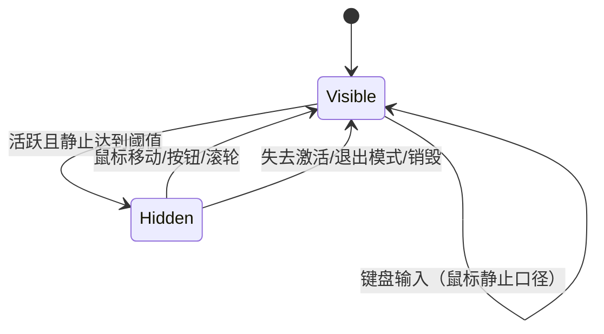

# Windows 系统软件隐藏鼠标指针的机制、API 与空闲隐藏实现

> 面向：Windows 桌面应用开发、播放器/演示/Kiosk/游戏与远程控制类软件开发者  
> 研究日期：2026-08-28  
> 研究范围：经典 Win32 桌面；补充 WinForms、WPF 与 UWP 的框架映射。主要结论适用于 Windows 10/11。  
> 术语说明：本文的“鼠标”“光标”“指针”均指屏幕上的 mouse pointer，不指文本插入光标（caret）。

## 1. 结论先行

1. **Windows 没有一个通用的“鼠标静止 N 秒后自动隐藏”系统开关或单一 API。**系统提供的 Mouse Vanish 功能是“用户键入时隐藏，移动鼠标后恢复”，不是按静止时长触发。要实现“长时间不动就隐藏”，应用必须自行定义活动范围、记录最后活动时间、定时判定并切换可见状态。[Microsoft Learn：Mouse Input Overview](https://learn.microsoft.com/en-us/windows/win32/inputdev/about-mouse-input)；[SystemParametersInfo](https://learn.microsoft.com/en-us/windows/win32/api/winuser/nf-winuser-systemparametersinfoa)

2. **普通桌面应用最稳妥的局部方案是 `SetCursor(NULL)` + 处理 `WM_SETCURSOR`。**`SetCursor(NULL)` 能移除当前指针图像；但鼠标再次移动时，系统通常会按窗口类光标重绘，所以隐藏状态下应在 `WM_SETCURSOR` 中再次 `SetCursor(NULL)` 并返回 `TRUE`。该模式天然适合“只在本应用客户区、全屏画布或捕获鼠标期间隐藏”。[Microsoft Learn：SetCursor](https://learn.microsoft.com/en-us/windows/win32/api/winuser/nf-winuser-setcursor)；[WM_SETCURSOR](https://learn.microsoft.com/en-us/windows/win32/menurc/wm-setcursor)

3. **`ShowCursor(FALSE)` 不是一个幂等的 `visible=false`。**它每调用一次就把内部显示计数减 1，计数小于 0 才真正隐藏；`ShowCursor(TRUE)` 则加 1。调用必须严格成对，且应在拥有相关窗口的 UI 线程上完成。Win32 中该计数是线程局部状态，因此它不是可靠的跨进程、全桌面隐藏手段。[Microsoft Learn：ShowCursor](https://learn.microsoft.com/en-us/windows/win32/api/winuser/nf-winuser-showcursor)；[Raymond Chen：ShowCursor 的设计与线程范围](https://devblogs.microsoft.com/oldnewthing/20091217-00/?p=15643)

4. **“长时间不动”的定义决定检测 API：**

   - 只关心本窗口客户区中的鼠标移动：处理 `WM_MOUSEMOVE`，用 `GetTickCount64` 记录时间，`SetTimer` 周期检查；这是本文推荐的默认方案。
   - 只要仍位于一个小矩形内就算“悬停”：可用 `TrackMouseEvent(TME_HOVER)`，但它是矩形/一次性语义，不等价于严格静止。
   - 关心当前登录会话的“完全无人操作”：用 `GetLastInputInfo`；它包含键盘等输入，不是“仅鼠标不动”，也不覆盖其他登录会话。
   - 关心鼠标设备在应用后台是否真的产生数据：注册 Raw Input，接收 `WM_INPUT`；通常优于低级鼠标钩子。

5. **应用可以在自己的交互范围内可靠隐藏，但不应试图替其他应用长期、全局地隐藏。**光标是共享用户资源；Windows 文档要求窗口仅在自己的客户区或捕获鼠标时设置光标。`SetSystemCursor` 是替换系统光标图像的全局配置接口，不是可见性接口，不应通过“透明光标”把它滥用为全局隐藏。[Microsoft Learn：SetCursor](https://learn.microsoft.com/en-us/windows/win32/api/winuser/nf-winuser-setcursor)；[SetSystemCursor](https://learn.microsoft.com/en-us/windows/win32/api/winuser/nf-winuser-setsystemcursor)

## 2. Windows 光标显示链路

经典桌面环境中，系统只有一个当前屏幕指针图像；窗口、线程与输入队列决定在某个时刻使用什么图像、是否绘制。可将逻辑拆成四层：

| 层次 | 负责什么 | 代表 API/消息 |
| --- | --- | --- |
| 输入来源 | 鼠标、触控板、笔、触摸等是否产生输入 | `WM_MOUSEMOVE`、`WM_POINTER*`、Raw Input、`WM_INPUT` |
| 窗口选形 | 指针进入客户区/非客户区时选用哪种形状 | `WM_SETCURSOR`、`SetCursor`、窗口类 `hCursor` |
| 可见性门控 | 当前图像是否被画出来 | `ShowCursor` 的显示计数；`SetCursor(NULL)`；触摸/笔抑制 |
| 策略层 | 何时隐藏、何时恢复 | 应用状态机；`SPI_*MOUSEVANISH`；应用自定义空闲计时 |

鼠标移动且未被捕获时，窗口会收到 `WM_SETCURSOR`。如果应用不处理，`DefWindowProc` 先给父窗口处理机会；随后在客户区使用注册的窗口类光标，在非客户区使用系统相应光标。正因为这个默认过程存在，单独调用一次 `SetCursor(NULL)` 往往只隐藏到下一次移动。[Microsoft Learn：WM_SETCURSOR](https://learn.microsoft.com/en-us/windows/win32/menurc/wm-setcursor)；[Setting the Cursor Image](https://learn.microsoft.com/en-us/windows/win32/learnwin32/setting-the-cursor-image)



## 3. 三种真正的隐藏机制

### 3.1 `SetCursor(NULL)`：形状层面的局部隐藏

`HCURSOR SetCursor(HCURSOR hCursor)` 设置当前光标形状；传 `NULL` 时，文档明确说明会从屏幕移除光标。它返回前一个 `HCURSOR`，但返回 `NULL` 既可能表示此前没有光标，因此不要只靠返回值判断调用成功。[Microsoft Learn：SetCursor](https://learn.microsoft.com/en-us/windows/win32/api/winuser/nf-winuser-setcursor)

适用条件：

- 指针位于本窗口客户区；
- 或本窗口正通过 `SetCapture` 捕获鼠标；
- 或应用拥有一个明确的全屏/相对鼠标交互模式。

持续隐藏的关键：

```cpp
case WM_SETCURSOR:
    if (cursorHidden && LOWORD(lParam) == HTCLIENT) {
        SetCursor(nullptr);
        return TRUE; // 阻止 DefWindowProc/类光标继续覆盖
    }
    break;
```

若窗口类注册了非空 `hCursor`，系统会在移动时恢复类光标。两种合法做法是：

- 保持类光标，按上例在 `WM_SETCURSOR` 中根据状态覆盖；这是对现有程序侵入最小的做法。
- 将窗口类光标设为 `NULL`，完全由窗口过程处理 `WM_SETCURSOR`；适合渲染画布，但要保证每个可见状态都明确设置正确光标。

不要在标题栏、调整大小边框、系统菜单上强制隐藏；这些非客户区光标承担操作提示。默认只对 `HTCLIENT` 返回 `TRUE`。

### 3.2 `ShowCursor`：计数器门控

`int ShowCursor(BOOL bShow)` 的行为是：

| 调用 | 计数变化 | 结果条件 |
| --- | --- | --- |
| `ShowCursor(FALSE)` | 显示计数 `-1` | 新计数 `< 0` 时隐藏 |
| `ShowCursor(TRUE)` | 显示计数 `+1` | 新计数 `>= 0` 时显示 |

函数返回**变化后的计数**。装有鼠标时初始计数通常为 0，因此第一次 `FALSE` 通常得到 -1 并隐藏；但若其他代码已增加计数，一次 `FALSE` 不一定隐藏。[Microsoft Learn：ShowCursor](https://learn.microsoft.com/en-us/windows/win32/api/winuser/nf-winuser-showcursor)

Win32 的关键语义是线程局部：调用会影响属于该线程窗口的光标显示状态；通过 `AttachThreadInput` 合并输入队列的线程会共享相关状态。这个范围由 Windows 团队 Raymond Chen 的官方技术文章明确说明。[The Old New Thing：What was the ShowCursor function intended to be used for?](https://devblogs.microsoft.com/oldnewthing/20091217-00/?p=15643)

工程规则：

- 只在进入一个明确模式时隐藏，退出同一模式时显示；例如全屏演示、视频播放、相对鼠标视角。
- 由同一个 UI 线程成对调用；不要从工作线程“帮 UI 隐藏”。
- 用布尔状态/RAII 防止重复进入导致多减一次。
- 不要用循环把计数强行减到负数或加到非负数；这会破坏同线程中其他组件的配对关系。
- Windows 8 起检查实际全局可见状态应调用 `GetCursorInfo`，而不是通过额外调用 `ShowCursor` 探测。

一个最小配对封装：

```cpp
class ScopedCursorHide {
public:
    ScopedCursorHide() : active_(true) { ShowCursor(FALSE); }
    ScopedCursorHide(const ScopedCursorHide&) = delete;
    ScopedCursorHide& operator=(const ScopedCursorHide&) = delete;
    ~ScopedCursorHide() { if (active_) ShowCursor(TRUE); }
private:
    bool active_;
};
```

这个封装解决“本对象重复恢复”的问题，但仍要求它在正确 UI 线程创建和销毁，也不能修复同线程其他代码已经造成的计数失衡。

### 3.3 Mouse Vanish：系统的“键入时隐藏”策略

系统参数：

```cpp
BOOL enabled = FALSE;
SystemParametersInfoW(SPI_GETMOUSEVANISH, 0, &enabled, 0);

SystemParametersInfoW(
    SPI_SETMOUSEVANISH,
    0,
    reinterpret_cast<PVOID>(static_cast<ULONG_PTR>(TRUE)),
    SPIF_UPDATEINIFILE | SPIF_SENDCHANGE);
```

语义是用户键入时隐藏鼠标指针，用户移动鼠标时重新显示。它不接受毫秒阈值，不能实现“静止 3 秒后隐藏”。`SPI_SETMOUSEVANISH` 会改变用户级系统偏好，普通应用通常只应读取并尊重，不应未经用户明确选择就修改；设置后如需持久化并通知其他程序，可使用 `SPIF_UPDATEINIFILE | SPIF_SENDCHANGE`。[Microsoft Learn：SystemParametersInfo / SPI_GETMOUSEVANISH / SPI_SETMOUSEVANISH](https://learn.microsoft.com/en-us/windows/win32/api/winuser/nf-winuser-systemparametersinfoa)

### 3.4 触摸/笔导致的系统抑制

Windows 8 起，系统可能因为当前输入来自触摸或笔而不绘制鼠标指针。`GetCursorInfo` 的 `CURSORINFO.flags` 可区分：

| `flags` | 含义 |
| --- | --- |
| `0` | 隐藏 |
| `CURSOR_SHOWING` (`0x1`) | 正在显示 |
| `CURSOR_SUPPRESSED` (`0x2`) | 因触摸或笔输入而由系统抑制 |

这说明“当前看不见”不一定是应用调用 `ShowCursor(FALSE)` 的结果。[Microsoft Learn：CURSORINFO](https://learn.microsoft.com/en-us/windows/win32/api/winuser/ns-winuser-cursorinfo)；[GetCursorInfo](https://learn.microsoft.com/en-us/windows/win32/api/winuser/nf-winuser-getcursorinfo)

```cpp
CURSORINFO ci{ sizeof(ci) };
if (GetCursorInfo(&ci)) {
    const bool showing   = (ci.flags & CURSOR_SHOWING) != 0;
    const bool suppressed = (ci.flags & CURSOR_SUPPRESSED) != 0;
}
```

## 4. “长时间不动”的四种口径

### 4.1 口径 A：本应用客户区内没有鼠标活动（推荐默认）

定义：光标位于本应用客户区，若连续 N 毫秒没有移动、按钮或滚轮事件，则隐藏；任何鼠标活动立即显示。

实现部件：

- `WM_MOUSEMOVE`：记录 `GetTickCount64()`；若已隐藏，立即显示。
- `WM_*BUTTON*`、`WM_MOUSEWHEEL`：按产品语义计为鼠标活动。
- `SetTimer` / `WM_TIMER`：每 100～250 ms 检查一次；无需 1 ms 精度。
- `GetCursorPos` + `WindowFromPoint`/`IsChild`：隐藏前确认指针仍在本应用客户区。
- `WM_SETCURSOR`：隐藏期间阻止类光标重绘。
- `WM_ACTIVATEAPP(FALSE)`、退出全屏、弹出系统 UI、窗口销毁：无条件恢复。

优点是范围可控、不会监视其他程序、易于恢复。缺点是窗口未捕获鼠标且指针在别处时，应用收不到移动消息——但这正符合“只管理自己的指针”原则。

### 4.2 口径 B：光标停留在小范围内达到时长

`TrackMouseEvent` 可请求 `TME_HOVER`，系统会在光标于指定 hover 矩形内停留指定时间后发送 `WM_MOUSEHOVER`。它不是“坐标一像素都没变”，并且 hover 消息触发后跟踪停止，若还要继续跟踪必须重新调用。[Microsoft Learn：TrackMouseEvent](https://learn.microsoft.com/en-us/windows/win32/api/winuser/nf-winuser-trackmouseevent)

适合工具提示、悬停预览等标准 UI；若产品要求严格的可配置空闲隐藏，周期计时状态机更清晰。

### 4.3 口径 C：当前登录会话没有任何用户输入

`GetLastInputInfo` 返回最后输入事件的 tick。它适合屏保、锁定前提示、Kiosk 空闲等“人是否离开”判断，但有三点限制：[Microsoft Learn：GetLastInputInfo](https://learn.microsoft.com/en-us/windows/win32/api/winuser/nf-winuser-getlastinputinfo)

- 包含键盘等输入，所以用户一直打字时不会进入空闲；它不是“鼠标不动”。
- 只覆盖调用进程所在会话，不是所有 RDP/快速用户切换会话的全局汇总。
- `dwTime` 不保证严格单调；Raw Input 线程与桌面线程时序、`SendInput` 自带时间戳等都可能造成回退。

阈值通常远小于 49.7 天时，可用 32 位无符号模减处理一次 `GetTickCount` 回绕：

```cpp
bool IsSessionIdleFor(DWORD thresholdMs) {
    LASTINPUTINFO lii{ sizeof(lii) };
    if (!GetLastInputInfo(&lii)) return false;

    const DWORD elapsed = static_cast<DWORD>(GetTickCount() - lii.dwTime);
    // 防御异常的“未来时间戳”；光标隐藏无需支持超过 24.8 天的阈值。
    if (elapsed > 0x7FFFFFFFu) return false;
    return elapsed >= thresholdMs;
}
```

不要直接用 `GetTickCount64() - lii.dwTime`：`lii.dwTime` 是 32 位 tick，机器运行超过约 49.7 天后两者不在同一取模域。若自己记录事件时间，则直接存 `ULONGLONG GetTickCount64()` 最简单。[Microsoft Learn：GetTickCount](https://learn.microsoft.com/en-us/windows/win32/api/sysinfoapi/nf-sysinfoapi-gettickcount)

### 4.4 口径 D：后台也要知道鼠标设备是否产生移动

应用可为 Generic Desktop / Mouse（Usage Page `0x01`，Usage `0x02`）注册 Raw Input；使用 `RIDEV_INPUTSINK` 并指定目标窗口后，即使目标窗口不是前台，也能接收相应 `WM_INPUT`。用 `GetRawInputData` 读取 `RAWMOUSE` 的相对/绝对移动与按钮信息。[Microsoft Learn：Using Raw Input](https://learn.microsoft.com/en-us/windows/win32/inputdev/using-raw-input)；[RAWINPUTDEVICE](https://learn.microsoft.com/en-us/windows/win32/api/winuser/ns-winuser-rawinputdevice)

注意：

- 进程默认不会收到 Raw Input，必须注册。
- 每个进程、每类 Raw Input 设备只能有一个注册目标窗口；库不应擅自注册，以免覆盖宿主应用的处理。[RegisterRawInputDevices](https://learn.microsoft.com/en-us/windows/win32/api/winuser/nf-winuser-registerrawinputdevices)
- Raw Input 解决的是“检测”，并不会授予跨应用隐藏指针的合理所有权。
- 高轮询率鼠标可能产生大量数据；高频场景应正确消费 `WM_INPUT`，必要时用 `GetRawInputBuffer`。

低级钩子 `WH_MOUSE_LL` 也能观察跨线程鼠标事件，但回调必须极快；超时可被系统静默移除。微软文档明确建议多数监视场景优先 Raw Input，因为它能更有效地异步监视输入。[Microsoft Learn：LowLevelMouseProc](https://learn.microsoft.com/en-us/windows/win32/winmsg/lowlevelmouseproc)

## 5. 推荐实现：本窗口静止 3 秒隐藏

下面是一个可移植到现有 Win32 窗口过程的核心示例。设计目标：

- 只隐藏本窗口客户区中的指针；
- 3 秒不发生鼠标移动/点击/滚轮就隐藏；
- 任意鼠标活动、失去激活或窗口销毁时恢复；
- 不触碰 `ShowCursor` 计数器，避免嵌套组件失衡。

```cpp
#include <windows.h>

namespace {
constexpr UINT_PTR kIdleTimerId = 1;
constexpr UINT     kTimerPeriodMs = 200;
constexpr ULONGLONG kHideAfterMs = 3000;

bool      g_cursorHidden = false;
ULONGLONG g_lastMouseActivity = 0;
HCURSOR   g_visibleCursor = nullptr;

bool CursorIsInClientTree(HWND hwnd) {
    POINT pt{};
    if (!GetCursorPos(&pt)) return false;

    HWND hit = WindowFromPoint(pt);
    if (hit != hwnd && !IsChild(hwnd, hit)) return false;

    if (!ScreenToClient(hwnd, &pt)) return false;
    RECT rc{};
    if (!GetClientRect(hwnd, &rc)) return false;
    return PtInRect(&rc, pt) != FALSE;
}

void ShowOwnedCursor() {
    if (!g_cursorHidden) return;
    g_cursorHidden = false;
    SetCursor(g_visibleCursor); // 单一画布示例；复杂 UI 应重新计算正确形状
}

void MarkMouseActivity() {
    g_lastMouseActivity = GetTickCount64();
    ShowOwnedCursor();
}
} // namespace

LRESULT CALLBACK WndProc(HWND hwnd, UINT msg, WPARAM wParam, LPARAM lParam) {
    switch (msg) {
    case WM_CREATE:
        g_visibleCursor = LoadCursorW(nullptr, IDC_ARROW); // 共享句柄，不要销毁
        g_lastMouseActivity = GetTickCount64();
        if (!SetTimer(hwnd, kIdleTimerId, kTimerPeriodMs, nullptr)) return -1;
        return 0;

    case WM_MOUSEMOVE:
    case WM_LBUTTONDOWN:
    case WM_LBUTTONUP:
    case WM_RBUTTONDOWN:
    case WM_RBUTTONUP:
    case WM_MBUTTONDOWN:
    case WM_MBUTTONUP:
    case WM_MOUSEWHEEL:
    case WM_MOUSEHWHEEL:
        MarkMouseActivity();
        break;

    case WM_SETCURSOR:
        if (g_cursorHidden && LOWORD(lParam) == HTCLIENT) {
            SetCursor(nullptr);
            return TRUE;
        }
        break;

    case WM_TIMER:
        if (wParam == kIdleTimerId) {
            const bool eligible =
                !g_cursorHidden &&
                GetForegroundWindow() == hwnd &&
                GetCapture() == nullptr && // 拖拽/捕获期间不隐藏
                CursorIsInClientTree(hwnd);

            if (eligible &&
                GetTickCount64() - g_lastMouseActivity >= kHideAfterMs) {
                g_cursorHidden = true;
                SetCursor(nullptr); // 光标不动时立即移除
            }
            return 0;
        }
        break;

    case WM_ACTIVATEAPP:
        if (wParam == FALSE) ShowOwnedCursor();
        break;

    case WM_DESTROY:
        ShowOwnedCursor();
        KillTimer(hwnd, kIdleTimerId);
        PostQuitMessage(0);
        return 0;
    }

    return DefWindowProcW(hwnd, msg, wParam, lParam);
}
```

`SetTimer` 在超时后向窗口消息队列投递 `WM_TIMER`；200 ms 的检查周期足以让 3 秒阈值的体感稳定，又不会制造高频唤醒。[Microsoft Learn：SetTimer](https://learn.microsoft.com/en-us/windows/win32/api/winuser/nf-winuser-settimer)

真实产品应再处理：

- `WM_NCMOUSEMOVE`：指针进入标题栏/边框时立即恢复；
- XBUTTON、拖放、菜单循环、模态对话框与自定义子窗口；
- 多个顶层窗口各自维护状态，不要使用示例中的进程全局变量；
- 可配置的“永不隐藏”选项和键盘 Escape 恢复；
- 若控件有 I-beam、resize、hand 等多种可见光标，恢复时调用统一的“按当前命中位置求光标”逻辑，而不是固定 `IDC_ARROW`。

## 6. 睡眠、计时器与时钟选择

### 6.1 是否把睡眠时间算作空闲

`GetTickCount`/`GetTickCount64` 统计自系统启动以来的经过时间，并计入睡眠/休眠。因此机器睡眠 30 分钟、唤醒后，基于它的空闲判断会立即超过 3 秒阈值。[Microsoft Learn：Interrupt Time](https://learn.microsoft.com/en-us/windows/win32/sysinfo/interrupt-time)

两种产品语义：

- **计入睡眠：**播放器/Kiosk 唤醒后若尚无鼠标活动，可以立即隐藏；使用 `GetTickCount64`。
- **不计入睡眠：**希望用户唤醒后仍有完整 3 秒观察时间；可在电源恢复消息时重置最后活动时间，或使用 `QueryUnbiasedInterruptTime` 记录和比较。后者只统计系统工作状态时间。

不要把不同时间域混用：事件时间与当前时间必须都来自同一 API/同一单位。

### 6.2 精度与回绕

- 自己记录事件：优先 `GetTickCount64`，无需处理约 49.7 天的 32 位回绕。
- 使用 `LASTINPUTINFO.dwTime`：它固定为 32 位，配套用 `GetTickCount` 做无符号模减。
- 鼠标隐藏阈值通常为秒级，不需要高分辨率计时器或 `timeBeginPeriod`。
- `WM_TIMER` 是调度检查点，不保证在某个毫秒精确执行；只要比较真实 elapsed time，消息稍晚不会累积漂移。

## 7. 何时“能够”及“应该”隐藏

| 场景 | 技术上可行 | 推荐策略 |
| --- | --- | --- |
| 全屏视频播放、幻灯片 | 是 | 静止数秒后在客户区隐藏；移动、点击、Alt+Tab、退出全屏恢复 |
| 第一人称/3D 相对鼠标模式 | 是 | 进入模式即隐藏，退出/失焦即恢复；结合 Raw Input 或平台相对鼠标 API |
| Kiosk/数字标牌 | 是 | 应用前台且指针在其窗口内隐藏；保留明确恢复路径 |
| 普通表单、文本编辑 | 技术上可行但通常不应 | 优先尊重系统 Mouse Vanish；不要让用户丢失定位反馈 |
| 拖拽、调整窗口大小、菜单、对话框 | 不宜 | 显示正确操作光标；捕获/模式结束后再恢复空闲策略 |
| 应用处于后台 | 不应 | 即使 Raw Input 能检测，也不应改其他应用的可见性 |
| 整个桌面、所有应用全局隐藏 | 公共 Win32 可见性模型不提供可靠所有权 | 不要用 `ShowCursor`、透明系统光标或钩子强行实现；Shell/Kiosk 专用环境应由平台策略整体设计 |

安全恢复条件至少包括：

- 鼠标移动；
- 鼠标按钮或滚轮；
- 本窗口失去前台/激活；
- 退出全屏、相对输入或演示模式；
- 打开菜单、模态对话框或可交互覆盖层；
- 销毁窗口/关闭程序。

## 8. API 选型表

| API/消息 | 作用 | 范围/关键语义 | 是否适合“静止 N 秒隐藏” |
| --- | --- | --- | --- |
| `SetCursor(NULL)` | 移除当前光标图像 | 仅应在本客户区或鼠标捕获期间使用 | **是，作为隐藏动作** |
| `WM_SETCURSOR` | 决定当前命中区域的光标 | 返回 `TRUE` 阻止默认/类光标覆盖 | **是，维持隐藏** |
| `ShowCursor(FALSE/TRUE)` | 修改显示计数 | 线程局部、非幂等、必须成对 | 可用，但不如局部状态清晰 |
| `GetCursorInfo` | 查询全局光标状态/句柄/位置 | 能区分 showing、hidden、suppressed | 用于诊断/验证，不是触发器 |
| `SPI_GET/SETMOUSEVANISH` | 查询/设置“键入时隐藏” | 用户级系统设置，无时长参数 | **否** |
| `WM_MOUSEMOVE` | 客户区移动通知 | 只到命中窗口或捕获窗口；可能合并高频消息 | **是，本窗口默认检测源** |
| `TrackMouseEvent` | hover/leave 检测 | 矩形停留、一次性，触发后须重注册 | 可选，不是严格静止 |
| `GetLastInputInfo` | 当前会话最后任意输入时间 | 含键盘；非跨会话；tick 可能回退 | 仅适合“无人操作”口径 |
| Raw Input / `WM_INPUT` | 设备级输入数据 | 可后台接收；每进程每设备类一个目标窗口 | **是，仅鼠标后台检测** |
| `WH_MOUSE_LL` | 低级鼠标钩子 | 回调超时风险，官方多数场景建议 Raw Input | 通常不推荐 |
| `SetTimer` / `WM_TIMER` | 周期检查 | UI 消息队列语义，非硬实时 | **是** |
| `GetTickCount64` | 自启动经过毫秒数 | 64 位，计入睡眠/休眠 | **是，自记录事件时间** |
| `QueryUnbiasedInterruptTime` | 系统工作状态经过时间 | 不计睡眠/休眠 | 是，若产品不计睡眠 |
| `SetSystemCursor` | 替换某个系统光标图像 | 全局用户体验，且会销毁传入句柄 | **否，不是隐藏 API** |
| `ClipCursor` | 限制移动矩形 | 限制位置，不改变可见性 | **否** |

## 9. 框架对应关系

### Windows Forms

`Cursor.Hide()` / `Cursor.Show()` 是高层入口；微软文档明确要求严格平衡，每次 Hide 必须有对应 Show。[Microsoft Learn：Cursor.Hide](https://learn.microsoft.com/en-us/dotnet/api/system.windows.forms.cursor.hide?view=windowsdesktop-10.0)

```csharp
private bool _hidden;

void SetHidden(bool hidden)
{
    if (_hidden == hidden) return;
    _hidden = hidden;
    if (hidden) Cursor.Hide();
    else Cursor.Show();
}
```

仍应在 `MouseMove`、`Deactivate`、`FormClosed` 等路径恢复。若需要严格控制某个控件区域，可通过 Win32 `WM_SETCURSOR` 或控件级光标策略处理。

### WPF

`Mouse.OverrideCursor = Cursors.None` 会强制整个 WPF 应用不显示鼠标指针，但鼠标事件仍继续处理；设回 `null` 清除覆盖。[Microsoft Learn：Mouse.OverrideCursor](https://learn.microsoft.com/en-us/dotnet/api/system.windows.input.mouse.overridecursor?view=windowsdesktop-10.0)

```csharp
Mouse.OverrideCursor = Cursors.None; // 隐藏
Mouse.OverrideCursor = null;         // 恢复由元素决定
```

如果只希望某个元素隐藏，优先设置元素 `Cursor` 并留意 `ForceCursor`、拖放、捕获和文本编辑等优先级。

### UWP/旧 CoreWindow 模型

相对鼠标模式的官方范式是进入模式时把 `CoreWindow.PointerCursor` 设为 `nullptr/null`，退出模式时恢复非空光标；绝对光标位置会保留，恢复后出现在原位置。[Microsoft Learn：Relative mouse movement](https://learn.microsoft.com/en-us/windows/uwp/gaming/relative-mouse-movement)

### Direct3D 与软件光标

Direct3D 9 还提供 `IDirect3DDevice9::ShowCursor` 管理 D3D 设备光标。微软示例在处理 `WM_SETCURSOR` 时先 `SetCursor(NULL)` 去掉 GDI/User32 光标，再显示 D3D 光标，并返回 `TRUE` 阻止窗口类光标覆盖。[Microsoft Learn：IDirect3DDevice9::ShowCursor](https://learn.microsoft.com/en-us/windows/win32/api/d3d9helper/nf-d3d9helper-idirect3ddevice9-showcursor)

现代游戏/引擎也可能自己在交换链中画一个 sprite 作为“软件光标”。此时屏幕上那张图不属于 `HCURSOR`，`SetCursor`、`ShowCursor` 和 `GetCursorInfo` 只能反映系统光标，渲染出来的软件光标必须在引擎层单独关闭。诊断时先确认可见图像由谁绘制，避免同时出现系统光标与软件光标，或只隐藏了其中一个。

## 10. 常见错误与原因

### 错误 1：`ShowCursor(FALSE)` 调一次却没有隐藏

原因：显示计数原本可能大于 0。解决方案不是循环调用，而是找出不平衡调用；对于客户区空闲隐藏，改用显式状态 + `SetCursor(NULL)`/`WM_SETCURSOR`。

### 错误 2：隐藏了，一动鼠标马上又出现

原因：`DefWindowProc` 或窗口类 `hCursor` 在 `WM_SETCURSOR` 中恢复。隐藏状态下处理 `WM_SETCURSOR`、设置 `NULL` 并返回 `TRUE`。

### 错误 3：在后台也把别的应用光标弄没了

原因：把共享资源当成进程私有资源，或滥用系统光标替换。只在本客户区/捕获期间改变；失焦立即恢复。

### 错误 4：用户打字时永远不隐藏

原因：用的是 `GetLastInputInfo`，键盘也会刷新“最后输入”。若需求是“鼠标不动”，记录 `WM_MOUSEMOVE` 或 Raw Input 的鼠标时间。

### 错误 5：运行 49.7 天后空闲时间异常

原因：把 32 位 `LASTINPUTINFO.dwTime` 与 64 位 tick 直接相减，或未按无符号模运算处理 `GetTickCount` 回绕。

### 错误 6：睡眠唤醒后立即隐藏

原因：`GetTickCount64` 计入睡眠。这可能是正确产品语义；若不是，在恢复时重置，或统一使用 unbiased interrupt time。

### 错误 7：把文本光标 API 当成鼠标 API

`ShowCaret`、`HideCaret`、`Console.CursorVisible` 控制的是文本插入光标/控制台光标，不控制鼠标指针。

## 11. 测试矩阵

| 测试维度 | 至少验证 |
| --- | --- |
| 基本时序 | 2.9 秒仍显示、3.x 秒隐藏、首次移动立即恢复 |
| 输入类型 | 移动、左右/中/X 按钮、垂直/水平滚轮、触控板 |
| 窗口区域 | 客户区、子控件、标题栏、缩放边框、窗口外 |
| 生命周期 | Alt+Tab、Win 键、最小化、恢复、关闭、崩溃后的系统恢复体验 |
| 模式 | 全屏进出、菜单、模态框、拖放、`SetCapture`/`ReleaseCapture` |
| 输入设备 | 鼠标、触控板、笔、触摸；检查 `CURSOR_SUPPRESSED` |
| 时间 | 睡眠/恢复、长时间运行、系统时钟调整（不应影响 tick 计时） |
| 会话 | 本地会话、RDP、快速用户切换；确认 `GetLastInputInfo` 只代表当前会话 |
| 多窗口/多线程 | 每个顶层窗口状态独立；`ShowCursor` 配对发生在同一 UI 线程 |
| 可访问性 | 高对比度、放大镜、键盘用户、用户禁用自动隐藏选项 |

建议在调试日志中记录：状态转换原因、最后鼠标时间、当前窗口/命中区域、激活状态、捕获窗口、`CURSORINFO.flags`。不要每个鼠标包都打生产日志。

## 12. 推荐决策

对播放器、演示、可视化画布等常见应用，推荐以下组合：

1. 用 `WM_MOUSEMOVE`/按钮/滚轮更新本窗口的 `lastMouseActivity`。
2. 用 `GetTickCount64` + 200 ms 左右 `SetTimer` 判断 2～5 秒阈值。
3. 达到阈值且窗口前台、指针在客户区、没有鼠标捕获时，设 `hidden=true` 并调用 `SetCursor(NULL)`。
4. 在 `WM_SETCURSOR` 中，若 `hidden && HTCLIENT`，再次 `SetCursor(NULL)` 并返回 `TRUE`。
5. 任意鼠标活动、失焦、模式退出、打开系统交互 UI、销毁窗口时恢复。
6. 只有在需求明确是“会话完全无人操作”时使用 `GetLastInputInfo`；只有后台设备检测确有必要时才引入 Raw Input。
7. 不修改 `SPI_SETMOUSEVANISH`，除非这是用户明确操作的设置项；不使用透明 `SetSystemCursor` 做全局隐藏。

## 13. 研究限制与证据边界

- 本报告以微软公开 Win32/.NET 文档和 Windows 团队官方技术文章为主，没有依赖逆向工程或未文档化的 `win32k` 内部结构。
- `ShowCursor` 的线程局部范围在 Microsoft Learn 函数页没有展开，依据 Windows 团队 Raymond Chen 的官方文章；这是高可信的一方解释，但不是 API 合同页的逐字保证。
- 不同 UI 框架、游戏引擎和远程桌面栈可能在 Win32 之上维护自己的软件光标。若屏幕上看到的是应用自己绘制的 sprite，而不是系统 `HCURSOR`，上述 User32 可见性 API 不会自动隐藏那张图；必须在引擎渲染层关闭。
- 报告不主张跨安全桌面、跨登录会话或跨进程强制控制；这些场景需要 Shell/Kiosk/远程桌面产品级架构，而不是一个光标 API。

## 14. 主要参考资料

以下均于 2026-08-28 访问。

| 来源 | 发布者 | 文档更新日期 | 用途 |
| --- | --- | --- | --- |
| [ShowCursor function](https://learn.microsoft.com/en-us/windows/win32/api/winuser/nf-winuser-showcursor) | Microsoft Learn | 2024-02-22 | 显示计数、阈值、返回值 |
| [What was the ShowCursor function intended to be used for?](https://devblogs.microsoft.com/oldnewthing/20091217-00/?p=15643) | Raymond Chen / Microsoft | 2009-12-17 | 历史设计、线程局部范围 |
| [SetCursor function](https://learn.microsoft.com/en-us/windows/win32/api/winuser/nf-winuser-setcursor) | Microsoft Learn | 2023-02-02 | `NULL` 隐藏、客户区边界、类光标恢复 |
| [WM_SETCURSOR message](https://learn.microsoft.com/en-us/windows/win32/menurc/wm-setcursor) | Microsoft Learn | 2020-12-11 | 默认处理、父窗口、命中区域 |
| [Using Cursors](https://learn.microsoft.com/en-us/windows/win32/menurc/using-cursors) | Microsoft Learn | 2023-03-27 | 类光标与移动时重绘 |
| [SystemParametersInfo](https://learn.microsoft.com/en-us/windows/win32/api/winuser/nf-winuser-systemparametersinfoa) | Microsoft Learn | 2024-03-27 | Mouse Vanish 与系统参数 |
| [Mouse Input Overview](https://learn.microsoft.com/en-us/windows/win32/inputdev/about-mouse-input) | Microsoft Learn | 2025-07-14 | 鼠标消息、捕获、Vanish 语义 |
| [GetCursorInfo](https://learn.microsoft.com/en-us/windows/win32/api/winuser/nf-winuser-getcursorinfo) / [CURSORINFO](https://learn.microsoft.com/en-us/windows/win32/api/winuser/ns-winuser-cursorinfo) | Microsoft Learn | 2024-02-22 | 全局可见状态与触摸/笔抑制 |
| [GetLastInputInfo](https://learn.microsoft.com/en-us/windows/win32/api/winuser/nf-winuser-getlastinputinfo) | Microsoft Learn | 2024-02-22 | 会话空闲检测与非单调限制 |
| [GetTickCount](https://learn.microsoft.com/en-us/windows/win32/api/sysinfoapi/nf-sysinfoapi-gettickcount) | Microsoft Learn | 2024-07-11 | 32 位回绕与计时 |
| [Interrupt Time](https://learn.microsoft.com/en-us/windows/win32/sysinfo/interrupt-time) | Microsoft Learn | 2024-07-09 | 睡眠计入/不计入的时间域 |
| [Using Raw Input](https://learn.microsoft.com/en-us/windows/win32/inputdev/using-raw-input) | Microsoft Learn | 2026-03-20 | Raw Input 注册与消费模式 |
| [RegisterRawInputDevices](https://learn.microsoft.com/en-us/windows/win32/api/winuser/nf-winuser-registerrawinputdevices) | Microsoft Learn | 2025-05-21 | 每进程设备类注册限制 |
| [LowLevelMouseProc](https://learn.microsoft.com/en-us/windows/win32/winmsg/lowlevelmouseproc) | Microsoft Learn | 2025-07-14 | 钩子超时与优先 Raw Input 建议 |
| [TrackMouseEvent](https://learn.microsoft.com/en-us/windows/win32/api/winuser/nf-winuser-trackmouseevent) | Microsoft Learn | 2021-10-13 | hover 矩形与一次性跟踪 |
| [SetTimer](https://learn.microsoft.com/en-us/windows/win32/api/winuser/nf-winuser-settimer) | Microsoft Learn | 2024-02-22 | UI 周期检查 |
| [Cursor.Hide](https://learn.microsoft.com/en-us/dotnet/api/system.windows.forms.cursor.hide?view=windowsdesktop-10.0) | Microsoft Learn / .NET | 持续更新 | WinForms 配对要求 |
| [Mouse.OverrideCursor](https://learn.microsoft.com/en-us/dotnet/api/system.windows.input.mouse.overridecursor?view=windowsdesktop-10.0) | Microsoft Learn / .NET | 持续更新 | WPF 全应用隐藏 |

---

**最终判断：**如果需求是“本应用前台时，鼠标停住几秒自动消失，一动就回来”，选择 `WM_MOUSEMOVE` + `GetTickCount64` + `SetTimer` + `SetCursor(NULL)` + `WM_SETCURSOR`。如果需求是“打字时隐藏”，尊重或查询 Mouse Vanish。若需求被描述为“整个 Windows 上全局长期隐藏”，应先重构需求范围；公开 Win32 可见性 API并不提供一个适合普通应用的、可靠且有所有权边界的全桌面开关。
